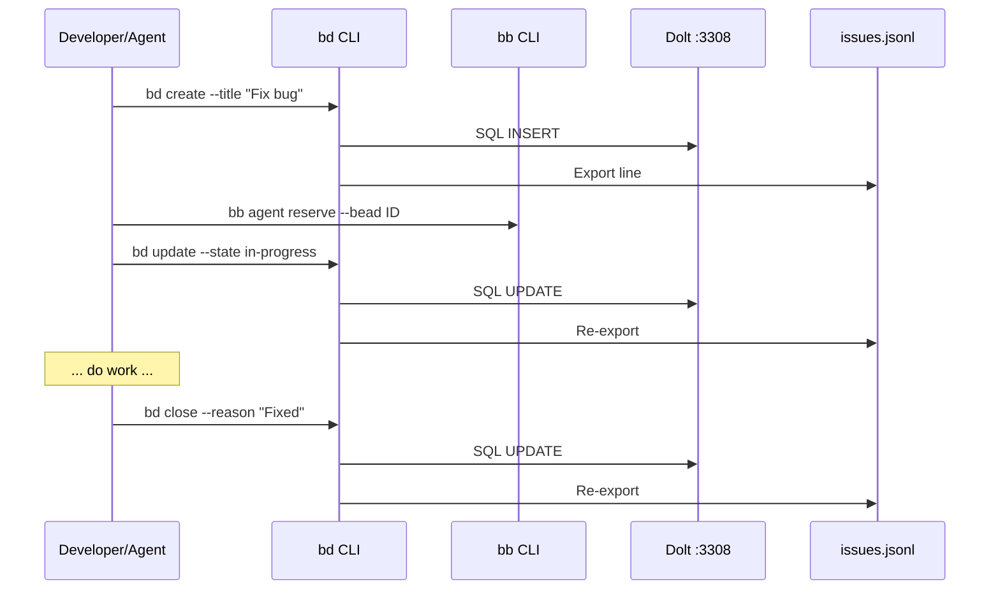

# Beads CLI (bd / bb)

## What

The BeadBoard ecosystem uses two CLIs that work together:

- **`bd` (Beads CLI)** -- Task management. Creates, updates, queries, and links beads. Writes to both Dolt and `.beads/issues.jsonl`.
- **`bb` (BeadBoard CLI)** -- Agent coordination. Registers agents, manages state transitions, routes mail, handles reservations.

## bd -- Beads CLI

### Installation

`bd` is a shell function wrapper defined in `~/.zshrc`. The wrapper auto-appends `--skip-agents` to `bd init` commands (agents are managed separately through BeadBoard, not through Beads' built-in agent system).

### Key Commands

| Command | Description |
|---------|-------------|
| `bd init --shared-server` | Initialize Beads in a project repo (creates `.beads/` dir, registers database on shared Dolt server) |
| `bd create` | Create a new bead (task) |
| `bd list` | List beads with optional filters |
| `bd update` | Update a bead's fields (state, assignee, notes) |
| `bd link` | Create a dependency link between beads |
| `bd slot set` | Set a bead's slot (priority/scheduling) |
| `bd agent state` | Get or set the agent's current state |
| `bd mail send` | Send mail to another agent |
| `bd mail inbox` | View incoming mail |
| `bd mail read` | Read a specific mail message |
| `bd mail ack` | Acknowledge a mail message |
| `bd config set` | Set Beads configuration values |
| `bd hooks install` | Install git hooks for Dolt/jsonl sync |

### Data Targets

Every write command produces dual output:

- **Dolt database** on `127.0.0.1:3308` -- durable, versioned, queryable
- **`.beads/issues.jsonl`** in the project repo -- triggers the dashboard's file watcher

:::info Dual Write Pattern
Every `bd` write goes to both Dolt (durable versioned store) and JSONL (file-system trigger for the dashboard watcher). This is intentional -- Dolt is the source of truth, JSONL is the notification channel.
:::

## bb -- BeadBoard CLI

### Installation

`bb` is installed globally from the BeadBoard repo (`~/github/joeblackwaslike/jordanhindo/beadboard/`).

### Key Commands

| Command | Description |
|---------|-------------|
| `bb agent register` | Register an agent session with the BeadBoard |
| `bb agent state` | Get or set agent state (idle, working, stuck, etc.) |
| `bb agent reserve` | Reserve a bead for the current agent to work on |
| `bb start` | Start the BeadBoard dashboard (alternative to launchd) |
| `bb daemon start` | Start the daemon (currently a no-op) |

### Environment

`bb` uses the `BB_AGENT` environment variable to identify the current agent session:

```bash
export BB_AGENT=code-reviewer
bb agent register
bb agent state working
```

## Common Workflows



### Create a bead and start working on it

```bash
bd create --title "Fix login bug" --priority high
bd list --state open
bb agent reserve --bead <bead-id>
bd update --bead <bead-id> --state in-progress --assignee "$BB_AGENT"
```

### Hand off a bead to another agent

```bash
bd update --bead <bead-id> --state handoff
bd mail send --to other-agent --cat HANDOFF --body "Context for the handoff..."
```

### Signal a blocker

```bash
bd update --bead <bead-id> --state blocked
bd mail send --to lead --cat BLOCKED --body "Blocked on API access..."
```

:::warning State Discipline
Always update bead state before sending mail. The mail category should match the bead state: `BLOCKED` mail goes with `blocked` state, `HANDOFF` goes with `handoff` state.
:::

## Health Check

```bash
# Verify bd is available (shell function)
type bd
# Expect: "bd is a shell function..."

# Verify bb is available
which bb

# Test Dolt connectivity
bd list
# Should return without connection errors
```

:::tip Quick Connectivity Test
If `bd list` returns a connection error, the shared Dolt server is likely down. Check with `lsof -i :3308` and restart if needed.
:::

## Dependencies

- **Shared Dolt Server** -- must be running on `:3308` for any `bd` write operation
- **`.beads/` directory** -- must exist in the project repo (`bd init` creates it)
- **`BB_AGENT` env var** -- must be set for `bb agent` commands

## Related Pages

- [System Overview](../system-overview.md) -- where the CLIs fit in the architecture
- [Data Flow](../data-flow.md) -- how CLI writes propagate to the dashboard
- [Dolt Server](./dolt-server.md) -- the database backing `bd` operations
- [Driver Skill](./driver-skill.md) -- the operating contract that orchestrates CLI usage
