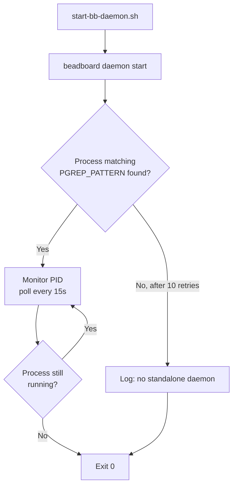

# Daemon

## What

The BeadBoard Daemon is a **forward-compatible supervisor stub**. It exists as infrastructure scaffolding so that when the upstream BeadBoard project ships a real daemon process, the launchd unit and wrapper script are already in place.

## Where

| Item | Path / Value |
|------|-------------|
| Wrapper script | `beadboard-ops/bin/start-bb-daemon.sh` |
| Supervisor | `com.beadboard.daemon` (launchd) |
| RunAtLoad | `true` |
| KeepAlive | `false` (one-shot) |

## Current Behavior

Right now, `bb daemon start` is a **no-op** -- there is no standalone daemon process. The wrapper script:

1. Runs `beadboard daemon start`
2. Waits up to 10 seconds for a process matching `PGREP_PATTERN`
3. If no process is found, exits 0 (success)

Because `KeepAlive` is `false`, launchd runs the wrapper once at login and does not restart it. This is intentional -- there is nothing to keep alive yet.



:::note Intentionally Idle
The daemon exits 0 and stays quiet. This is not a bug -- it's a placeholder for a future upstream feature. No action is required.
:::

## Health Check

```bash
# Check launchd status (will show "exited with code 0")
launchctl print gui/$(id -u)/com.beadboard.daemon

# Verify no daemon process is running (expected)
pgrep -f "beadboard daemon"
# No output is normal
```

## Upgrade Path

When the upstream BeadBoard project ships a real daemon:

1. Update `PGREP_PATTERN` in `beadboard-ops/bin/start-bb-daemon.sh` to match the actual daemon process name
2. Change `KeepAlive` from `false` to `true` in the launchd plist
3. Rerun `install.sh` to reload the updated plist
4. Verify the daemon starts and stays running: `pgrep -f "<new-pattern>"`

:::tip When to Upgrade
You'll know it's time when the BeadBoard project ships a standalone daemon process. Watch for changes to `bb daemon start` that actually spawn a long-running process.
:::

## Dependencies

- **BeadBoard CLI (`bb`)** -- must be installed and on `PATH`
- No other runtime dependencies (the daemon does nothing currently)

## Known Quirks

- The wrapper script exits 0 even when no daemon process is found -- this is by design, not a bug
- Logs will show a successful start followed by no activity -- also by design

:::info Exit Code 0 = Success
A one-shot service exiting 0 is the expected macOS launchd pattern for services that do setup work and exit. The `-` in the PID column of `launchctl list` confirms it ran and completed.
:::

## Related Pages

- [System Overview](../system-overview.md) -- where the daemon fits in the architecture
- [Dashboard](./dashboard.md) -- the active counterpart that does run
