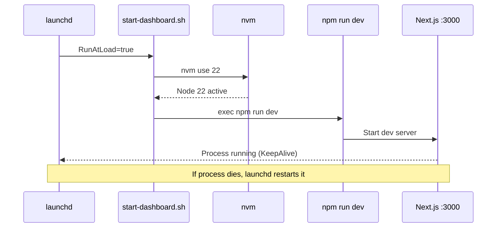

# Dashboard

## What

The BeadBoard Dashboard is a Next.js 15 + React 19 application providing a real-time UI for multi-agent task coordination. It displays beads (tasks), agent states, mail queues, and dependency graphs. The graph visualization uses `@xyflow/react` with Dagre for automatic layout.

**Tech stack:** Next.js 15, React 19, Tailwind CSS, TypeScript (strict mode), @xyflow/react, Dagre

## Where

| Item | Path / Value |
|------|-------------|
| Source code | `~/github/joeblackwaslike/jordanhindo/beadboard/` |
| URL | `http://localhost:3000` |
| Node version | 22 (via nvm) |
| Supervisor | `com.beadboard.dashboard` (launchd) |
| Wrapper script | `beadboard-ops/bin/start-dashboard.sh` |

## How It Runs

The launchd unit `com.beadboard.dashboard` starts at login (`RunAtLoad=true`) and restarts on failure (`KeepAlive=true`). The wrapper script:

1. Sources nvm
2. Runs `nvm use 22`
3. Runs `npm run dev`

The `--dolt` flag is deliberately omitted -- Dolt is managed as a separate launchd service (`com.beads.shared-dolt-server`).



## Key Source Files

| File | Role |
|------|------|
| `watcher.ts` | Chokidar-based file watcher monitoring `.beads/` directories across project repos |
| `parser.ts` | Reads and parses `.beads/issues.jsonl` into structured bead objects |
| `aggregate-read.ts` | Merges beads from multiple project repos into a unified set |
| `realtime.ts` | SSE event bus pushing bead/agent updates to connected browsers |

## API Endpoints

The dashboard exposes several API routes that agents and the UI consume:

| Endpoint | Purpose |
|----------|---------|
| `/api/agents/mail/batch` | Batch fetch pending mail for agents |
| `/api/agents/reservations/batch` | Batch fetch bead reservations by agent |
| `/api/runtime/worker-status` | Per-bead worker state tracking |

## Health Check

```bash
# Quick HTTP check
curl -s -o /dev/null -w '%{http_code}' http://localhost:3000
# Expect: 200

# Check launchd status
launchctl print gui/$(id -u)/com.beadboard.dashboard

# Check process
pgrep -f "next dev"
```

## Dependencies

- **Node 22** -- installed via nvm, selected by the wrapper script
- **BeadBoard checkout** -- source must exist at `~/github/joeblackwaslike/jordanhindo/beadboard/`
- **`.beads/` directories** -- must exist in project repos for the file watcher to detect changes
- **Shared Dolt Server** -- must be running on `:3308` for database-backed features

:::warning All Dependencies Must Be Met
If any dependency is missing (Node 22, BeadBoard repo, Dolt server), the dashboard will fail to start. Check `/tmp/beadboard-dashboard.err` for the specific error.
:::

## Known Quirks

- Uses `npm run dev` directly instead of `beadboard start` -- workaround for a missing script issue in the BeadBoard package
- The dashboard does NOT start Dolt on its own; it relies on the separate `com.beads.shared-dolt-server` launchd unit
- File watcher depends on jsonl files existing -- if a project has never run `bd create`, its `.beads/` directory may not exist yet

:::info Why npm run dev?
The `beadboard start` CLI tries to use a `~/.beadboard/runtime/` directory that is only partially populated. Running `npm run dev` directly from the repo checkout is the known-good workaround.
:::

| Check | Command | Expected | Status |
| ----- | ------- | -------- | ------ |
| HTTP responds | `curl -s -o /dev/null -w '%{http_code}' http://localhost:3000` | `200` | 🟢 OK |
| Process running | `pgrep -f "next dev"` | PID output | 🟢 OK |
| launchd healthy | `launchctl print gui/$(id -u)/com.beadboard.dashboard` | state = running | 🟢 OK |
| No errors | `tail -1 /tmp/beadboard-dashboard.err` | Empty or compilation warnings | 🟡 Check |

## Related Pages

- [System Overview](../system-overview.md) -- where the dashboard fits in the architecture
- [Data Flow](../data-flow.md) -- how beads flow from CLI to browser
- [Dolt Server](./dolt-server.md) -- the database the dashboard reads from
