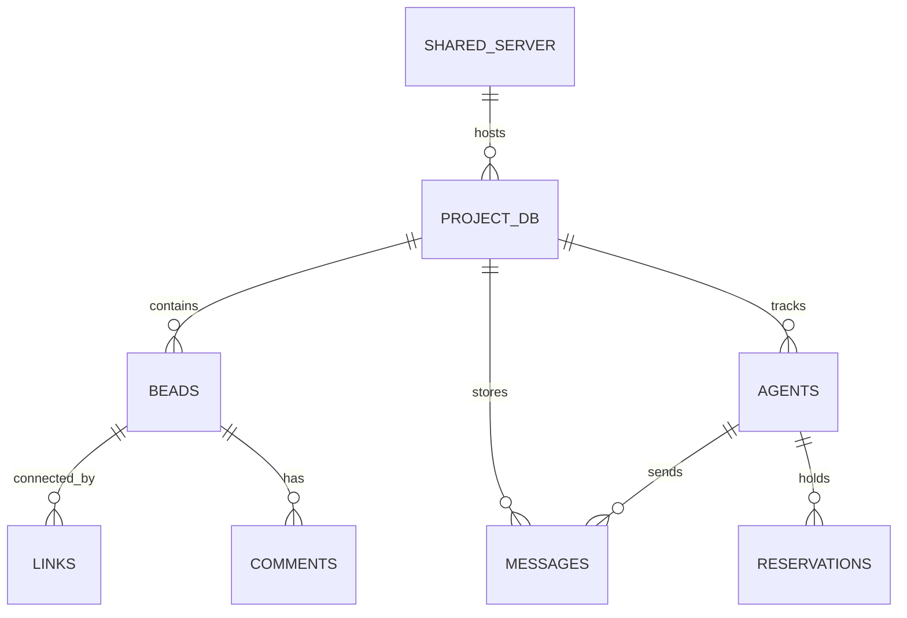

# Shared Dolt Server

## What

The Shared Dolt Server is the central SQL database for all Beads-managed projects. Dolt is a MySQL-compatible database with Git-like versioning (branches, commits, diffs). A single shared server instance hosts all project databases, avoiding the drift and port conflicts that come with per-project servers.



## Where

| Item | Path / Value |
|------|-------------|
| Data directory | `~/.beads/shared-server/dolt/` |
| Config file | `~/.beads/shared-server/dolt/config.yaml` |
| Binary | `/opt/homebrew/bin/dolt sql-server` |
| Host | `127.0.0.1` (localhost only) |
| Port | `3308` |
| Supervisor | `com.beads.shared-dolt-server` (launchd) |

## Project Databases

The server hosts 23 project databases:

`agency_agents`, `agent_improvement`, `agent_marketplace`, `ai_listings`, `ai_review_bot`, `beads_global`, `codex_review_bot`, `create_py_project`, `create_ts_project`, `ctx_tree`, `edgelite`, `idiomatic`, `lessons_learned`, `mac_bootstrap`, `mcp_exec`, `personal_agent_skills`, `safaribooks`, `test_project`, `upgraded`, and others.

Each project gets its own database when `bd init --shared-server` is run in that project's repo.

## Environment Variables

Set in `~/.zshenv` to ensure all `bd` invocations use the shared server:

```bash
export BEADS_DOLT_SHARED_SERVER=1   # Forces shared server mode
export BEADS_DOLT_SERVER_PORT=3308  # Explicit port binding
```

:::warning Never Skip These Variables
Without `BEADS_DOLT_SHARED_SERVER=1`, running `bd init` creates a per-project Dolt instance. This causes port conflicts, orphan servers, and database-name mismatches. Always set these in `~/.zshenv`.
:::

## Health Check

```bash
# Check if the server is listening
lsof -i :3308

# Query the server directly
mysql -h 127.0.0.1 -P 3308 -u root -e "SHOW DATABASES;"

# Check launchd status
launchctl print gui/$(id -u)/com.beads.shared-dolt-server

# Check the Dolt process
pgrep -f "dolt sql-server"
```

## Dependencies

- **Dolt binary** -- installed at `/opt/homebrew/bin/dolt` (via Homebrew)
- **Data directory** -- `~/.beads/shared-server/dolt/` must exist with a valid Dolt repo
- **Port 3308** -- must be free; no other process should bind to it

## Known Quirks

- **Benign warning:** `table not found: ignored_schema_migrations` appears in logs for projects that don't use schema migrations. This is harmless and can be ignored.

:::tip Silencing Warnings
The `ignored_schema_migrations` warning appears on every connection to a project that hasn't run migrations. It's harmless -- don't try to "fix" it by creating the table manually.
:::

- **Shared server is enforced globally** via `BEADS_DOLT_SHARED_SERVER=1` in `~/.zshenv`. The `--shared-server` flag on `bd init` is belt-and-suspenders.
- **Per-project servers drift:** If `bd init` is run without `--shared-server`, it creates a per-project Dolt instance that can conflict with the shared server. The `~/.zshrc` shell function wrapper auto-appends `--skip-agents` to `bd init` but relies on the env var for shared server enforcement.

## Connecting to Dolt

Use any MySQL-compatible client:

```bash
# MySQL CLI
mysql -h 127.0.0.1 -P 3308 -u root

# Then switch to a project database
USE ai_listings;
SHOW TABLES;

# Query beads
SELECT * FROM beads ORDER BY created_at DESC LIMIT 10;
```

Dolt also supports Git-style operations via SQL:

```sql
-- View commit history
SELECT * FROM dolt_log LIMIT 5;

-- View uncommitted changes
SELECT * FROM dolt_diff_beads;
```

:::info Git-Like Versioning
Dolt is unique among databases: every write creates a commit, every table has a full diff history, and you can branch/merge data like code. Use `dolt_log` and `dolt_diff_*` tables to explore the version history.
:::

## Related Pages

- [System Overview](../system-overview.md) -- where the Dolt server fits in the architecture
- [Data Flow](../data-flow.md) -- the dual-write pattern (Dolt + jsonl)
- [Beads CLI](./beads-cli.md) -- the CLI that writes to this database
