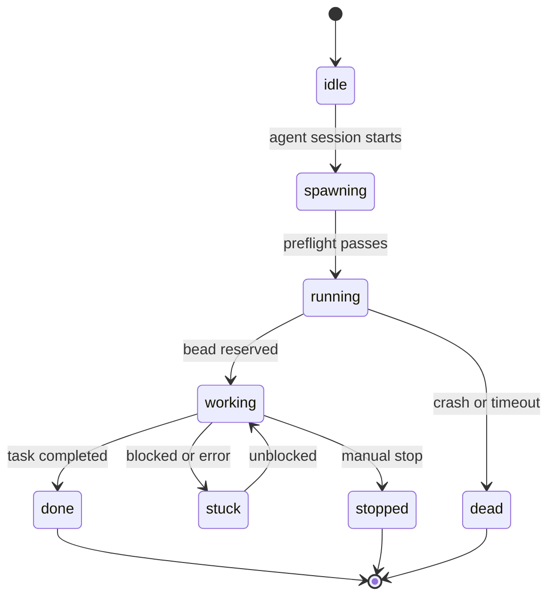

# Beadboard Driver Skill

## What

The Beadboard Driver Skill is the **agent-side operating contract** for multi-agent coordination. Every AI agent session that participates in the BeadBoard ecosystem loads this skill, which defines the rules of engagement: how to claim beads, transition states, communicate with other agents, and provide evidence of work.

## Where

| Item | Path / Value |
|------|-------------|
| Symlink (Claude Code) | `~/.claude/skills/beadboard-driver` |
| Symlink (Codex CLI) | `~/.codex/skills/beadboard-driver` |
| Symlink target | `~/github/joeblackwaslike/jordanhindo/beadboard/skills/beadboard-driver/` |
| Main runbook | `SKILL.md` |
| Scripts | `scripts/` |
| Reference docs | `references/` (12 files) |
| Agent definitions | `agents/` |
| Project template | `project.template.md` |

## The Iron Law

The single most important rule in the driver skill:

> **No bead claims, handoffs, or completion without assignee + coordination + evidence.**

Every state transition must have:

- **Assignee** -- who owns the bead
- **Coordination** -- proof that the transition was communicated (mail, state update)
- **Evidence** -- artifacts demonstrating work was done (commits, test results, links)

:::danger Violating the Iron Law
Work completed without following the Iron Law is considered non-existent. Other agents and the orchestrator will not recognize unauditable completions, and the bead will remain in its pre-claim state.
:::

## 9-Step Session Lifecycle

The driver skill defines a 9-step lifecycle that every agent session follows:

1. **Preflight** -- `session-preflight.mjs` validates the environment (Dolt running, agent registered, mail delegate set up)
2. **Register** -- Agent registers itself via `bb agent register`
3. **Check mail** -- Read any pending messages from other agents
4. **Pick work** -- Select a bead to work on via `bb agent reserve`
5. **Claim bead** -- Set bead state and assignee via `bd update`
6. **Do work** -- Execute the task (code, research, review, etc.)
7. **Record evidence** -- Commit artifacts, update bead with links/notes
8. **Transition** -- Move bead to next state (done, blocked, handoff)
9. **Report** -- Send mail to relevant agents, update dashboard state

:::tip Lifecycle Shortcut
Steps 0-1 (cache check + env verify) can be skipped entirely if `project.md` exists with all checks passing. This saves 30-60 seconds per session startup.
:::

## Key Scripts

| Script | Purpose |
|--------|---------|
| `bb-mail-shim.mjs` | Bridges `bd mail` commands to `bb agent` mail routing. Ensures mail reaches the correct agent regardless of which CLI the sender uses. |
| `session-preflight.mjs` | Runs at session start to validate prerequisites: Dolt server reachable, agent registered, correct env vars set. |
| `setup-mail-delegate.mjs` | Configures the mail delegation so `bd mail send` routes through the BeadBoard mail system. |

:::info Script Location
All scripts live in the driver skill's `scripts/` directory, which is symlinked from the BeadBoard repo. Updates to the repo automatically update the scripts.
:::

## Agent States

Agents transition through these states during their lifecycle:

| State | Meaning |
|-------|---------|
| `idle` | Registered but not active |
| `spawning` | Session starting, preflight running |
| `running` | Active session, no bead reserved yet |
| `working` | Actively working on a reserved bead |
| `stuck` | Blocked and needs intervention |
| `done` | Work completed, session winding down |
| `stopped` | Manually stopped by human or orchestrator |
| `dead` | Crashed or timed out |

## Mail Categories

Inter-agent mail is tagged with one of four categories:

| Category | When to Use |
|----------|-------------|
| `HANDOFF` | Passing a bead to another agent with context |
| `BLOCKED` | Signaling that work cannot continue without input |
| `DECISION` | Requesting a decision from a human or lead agent |
| `INFO` | Status updates, FYI messages, no action required |

:::warning BLOCKED Requires Follow-Up
Sending a `BLOCKED` mail changes your agent state to `stuck`. You must wait for a resolution before transitioning back to `working`. Don't continue working on a bead you've declared blocked.
:::

## Dependencies

- **BeadBoard repo checkout** -- the symlink target must exist at `~/github/joeblackwaslike/jordanhindo/beadboard/`
- **Symlinks** -- must be set up by `beadboard-ops/install.sh` or manually
- **Beads CLI (`bd`)** and **BeadBoard CLI (`bb`)** -- both must be on `PATH`

## Related Pages

- [System Overview](../system-overview.md) -- where the driver skill fits in the architecture
- [Data Flow](../data-flow.md) -- how mail and state changes flow through the system
- [Beads CLI](./beads-cli.md) -- the CLIs the driver skill orchestrates
