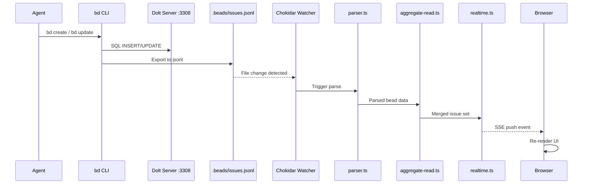
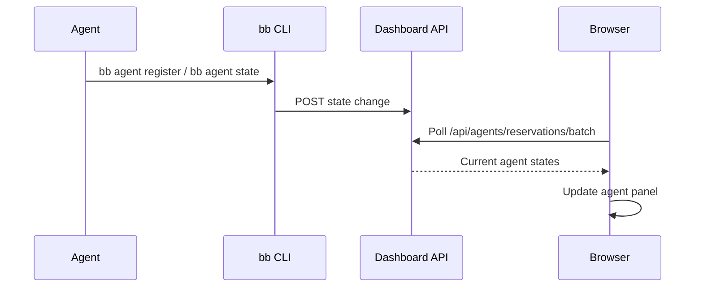
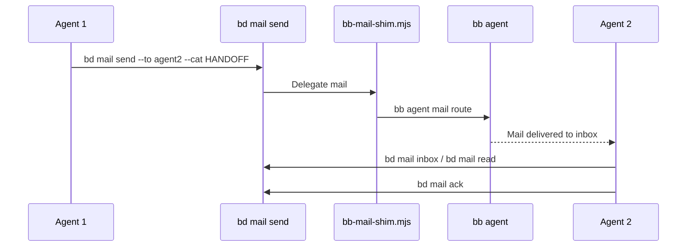

# Data Flow

This page traces how data moves through the BeadBoard ecosystem -- from an agent creating a bead to the browser reflecting the update in real time.

## Bead Lifecycle

A bead (task) flows through the system in 8 steps:

1. **Agent (or human) runs `bd create`** -- the Beads CLI writes the bead record to the Dolt database on `:3308` AND exports it to `.beads/issues.jsonl` in the project repo.
2. **Chokidar file watcher** (`watcher.ts`) detects the jsonl file change on disk.
3. **Parser** (`parser.ts`) reads and parses the updated jsonl file.
4. **Aggregator** (`aggregate-read.ts`) merges issues from multiple project repos into a unified view.
5. **SSE event bus** (`realtime.ts`) pushes the update to connected browsers.
6. **Browser** renders the updated bead state in the dashboard UI.
7. **Agent state changes** flow through `bb agent` commands, which the dashboard polls via API.
8. **Worker status** is tracked at `/api/runtime/worker-status` per bead.

:::tip Follow the Data
Understanding the data flow helps debug issues: if the dashboard doesn't show a new bead, check each hop -- Dolt write succeeded? JSONL updated? Watcher running? SSE connected?
:::

## Agent State Flow

Agent state transitions are managed through `bb agent` commands and surfaced in the dashboard via API polling.

**States:** `idle` -> `spawning` -> `running` -> `working` -> `stuck` / `done` / `stopped` / `dead`

:::note Polling vs Push
Agent state uses API polling (pull), not SSE push. The browser polls `/api/agents/reservations/batch` on an interval. This means agent state updates have a slight delay compared to bead changes.
:::

The dashboard polls two endpoints to keep its agent view current:

- **`/api/agents/mail/batch`** -- pending mail for agents
- **`/api/agents/reservations/batch`** -- which agents hold which beads

## Mail Flow

Mail is the inter-agent communication channel. Agents send structured messages categorized by intent.

**Mail categories:** `HANDOFF`, `BLOCKED`, `DECISION`, `INFO`

The `bb-mail-shim.mjs` script in the driver skill bridges `bd mail` commands to `bb agent` mail routing, ensuring mail reaches the correct agent session.

:::warning Mail Requires Delegate
If `mail.delegate` is not configured (via `setup-mail-delegate.mjs`), `bd mail send` will fail silently. Always run the preflight script at session start to verify the mail stack.
:::

## Dual Write Pattern

Every `bd` write operation produces two outputs:

| Target | Format | Purpose |
|--------|--------|---------|
| Dolt Server (`:3308`) | SQL rows | Durable storage, queryable history, branch-aware versioning |
| `.beads/issues.jsonl` | Newline-delimited JSON | File-system trigger for the dashboard's Chokidar watcher |

This dual-write is intentional -- the jsonl file serves as the real-time notification channel (file watching is cheaper than database polling), while Dolt provides the authoritative versioned store.

:::info Why Dual Write?
File watching (chokidar on JSONL) is cheaper and faster than database polling. Dolt provides the authoritative versioned store with Git-like branching; JSONL provides instant UI updates via the file system.
:::

---

## Key Source Files

| File | Role |
|------|------|
| `watcher.ts` | Chokidar-based file watcher for `.beads/` directories |
| `parser.ts` | Parses jsonl bead data into structured objects |
| `aggregate-read.ts` | Merges beads across multiple project repos |
| `realtime.ts` | SSE event bus pushing updates to browsers |
| `bb-mail-shim.mjs` | Bridges `bd mail` to `bb agent` mail routing |
| `session-preflight.mjs` | Validates agent session startup requirements |

---

## Related Pages

- [System Overview](./system-overview.md) -- component map and relationships
- [Dashboard](./components/dashboard.md) -- the Next.js app consuming this data
- [Dolt Server](./components/dolt-server.md) -- the database backing the dual-write
- [Beads CLI](./components/beads-cli.md) -- the CLI producing the writes
