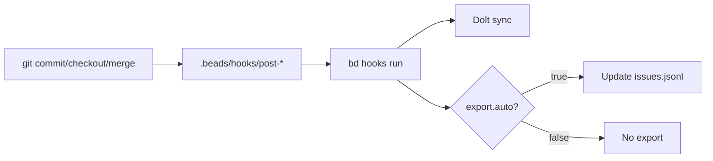
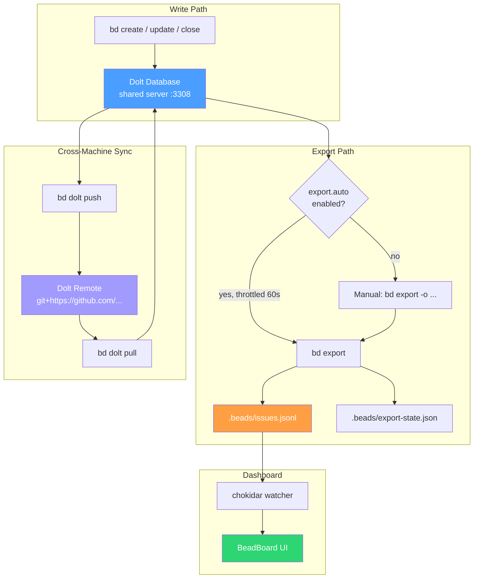

This document describes the sync architecture between the shared Dolt server and the `.beads/issues.jsonl` files that the BeadBoard dashboard consumes, along with audit results from `bin/verify-sync.sh`.

## Sync Architecture

### Data Flow Overview

Dolt is the **primary store** for all bead data. The `.beads/issues.jsonl` file is a **derived export artifact** — it is not a source of truth. The two are connected through an auto-export mechanism.

**Key design points:**

1. **Writes go to Dolt first.** Every `bd create`, `bd update`, `bd close`, etc. writes to the Dolt database via the shared server on `127.0.0.1:3308`.
2. **JSONL is an export, not a sync target.** The `issues.jsonl` file is produced by `bd export` and contains a snapshot of all issues (plus optionally memories) serialized as newline-delimited JSON.
3. **Auto-export is enabled across all projects.** Setting `export.auto=true` causes `bd` to re-export after write commands, throttled to once per 60 seconds. This was enabled across all 17 active projects on 2026-06-16.
4. **Template repos propagate the setting.** Both `spinup-ts` and `spinup-py` track `.beads/config.yaml` in git with `export.auto: true`, so new projects scaffolded from them inherit it automatically.
5. **The export-state.json tracks the last export.** It records the Dolt commit hash, timestamp, and issue/memory counts at export time, enabling drift detection.

:::tip Required for New Projects
When initializing beads in a new project, always enable auto-export:
```bash
bd init --shared-server --skip-agents
bd config set export.auto true
```
If the project was scaffolded from `spinup-ts` or `spinup-py`, this is already set.
:::

### What JSONL Contains

The export includes issues and (optionally) memories. The line count in `issues.jsonl` equals `export_state.issues + export_state.memories`, not the raw Dolt issue count. This is why some projects show one more line in JSONL than issues in Dolt (the extra line is a memory record).

Infrastructure beads (agents, rigs, roles, messages) are excluded by default. Use `bd export --all` to include them.

### Git Hooks

`bd hooks install` sets `core.hooksPath` to `.beads/hooks/` and places shims that call `bd hooks run <hook>`. The hooks provide:
- **pre-commit:** Runs chained hooks before commit
- **post-merge:** Runs chained hooks after pull/merge
- **post-checkout:** Runs chained hooks after branch checkout
- **pre-push:** Runs chained hooks before push
- **prepare-commit-msg:** Adds agent identity trailers

**Husky compatibility:** Projects using Husky set `core.hooksPath` to `.husky/_` (gitignored, regenerated on `pnpm install`). Running `bd hooks install` in these projects writes shims to `.husky/_`, which get wiped on the next `pnpm install`. The correct pattern is to add beads integration to the tracked `.husky/<hook>` files:

```bash
# Add to .husky/pre-commit, .husky/post-merge, .husky/post-checkout:
command -v bd >/dev/null 2>&1 && bd hooks run <hook> "$@" || true
```



### Cross-Machine Sync

:::info JSONL is Local Only
The JSONL file is a local notification artifact. Cross-machine sync uses Dolt remotes (`bd dolt push`/`bd dolt pull`), not JSONL file transfer.
:::

JSONL is **not** used for cross-machine sync. Dolt remotes (`bd dolt push`/`bd dolt pull`) handle that. The `sync.remote` config key points to the Dolt remote URL (typically the project's GitHub repo with `git+https://` prefix).



## Audit Results

### Initial Audit (2026-06-16)

The initial audit discovered that **all 17 projects had `export.auto=false`** (the default), causing JSONL drift across 4 projects and missing JSONL in 7 projects. Additionally, 4 projects had hook gaps, and 2 orphan databases existed on the shared server.

### Remediation (2026-06-16)

All issues were resolved in the same session:

| Action | Status |
|---|---|
| Enable `export.auto=true` across all 17 repos | ✅ Done |
| Fresh `bd export` across all 17 repos | ✅ Done |
| Track `export.auto: true` in spinup-ts template | ✅ Committed |
| Track `export.auto: true` in spinup-py template | ✅ Committed |
| Install hooks in codex-review-bot | ✅ Done |
| Fix stale hooksPath in spinup-py | ✅ Done |
| Add beads integration to edgelite Husky hooks | ✅ Done |
| Add beads integration to spinup-ts Husky hooks | ✅ Done |
| Re-initialize safaribooks (valid active repo) | ✅ Done |
| Drop orphan database: test_project | ✅ Done |
| Fix lessons-learned broken backup | ⚠️ Manual step required |

:::warning Manual Step Required
The lessons-learned backup needs a manual reset (safety net blocks destructive operations outside project cwd):
```bash
# Run manually:
cd ~/github/joeblackwaslike/lessons-learned
rm -rf .beads/backup
bd backup init .beads/backup
```
:::

### Post-Remediation State

After remediation, all projects with data are in sync:

| Project | Issues | JSONL | Hooks | Export | Sync |
|---|---|---|---|---|---|
| agency-agents | 0 | 0 | wired | auto | OK |
| agent-improvement | 0 | 0 | wired | auto | OK |
| agent-marketplace | 19 | 19 | wired | auto | OK |
| ai-listings | 47 | 47 | wired | auto | OK |
| ai-review-bot | 11 | 11 | wired | auto | OK |
| cc-recall | 14 | 14 | husky+bd | auto | OK |
| codex-review-bot | 2 | 2 | wired | auto | OK |
| ctx-tree | 14 | 14 | wired | auto | OK |
| edgelite | 1 | 1 | husky+bd | auto | OK |
| idiomatic | 17 | 17 | wired | auto | OK |
| lessons-learned | 81 | 81 | husky+bd | auto | OK |
| mac-bootstrap | 3 | 3 | wired | auto | OK |
| mcp-exec | 35 | 35 | wired | auto | OK |
| personal-agent-skills | 0 | 0 | wired | auto | OK |
| spinup-py | 0 | 0 | wired | auto | OK |
| spinup-ts | 0 | 0 | husky+bd | auto | OK |
| safaribooks | 0 | 0 | wired | auto | OK |
| upgraded | 13 | 13 | wired | auto | OK |

**Orphan databases removed:** test_project
**Total active databases:** 19 (18 projects + beads_global)

:::tip All Green
After remediation, all 18 active projects show OK sync status with auto-export enabled. This is the target state for any new project.
:::

---

## Ongoing Maintenance

### Preventing Drift

Drift is now prevented by three mechanisms:

1. **`export.auto=true`** — every `bd` write triggers a throttled JSONL re-export
2. **Git hooks** — `post-merge` and `post-checkout` hooks keep JSONL current across branch switches
3. **Template repos** — new projects scaffolded from spinup-ts/spinup-py inherit `export.auto: true`

:::note Three-Layer Defense
Drift prevention works in layers: (1) auto-export on writes, (2) git hooks on branch operations, (3) template repos for new projects. All three must be active for reliable sync.
:::

### Monitoring

Run the diagnostic script periodically to catch any regressions:

```bash
./bin/verify-sync.sh
```

### New Project Checklist

When adding beads to a new project:

1. `bd init --shared-server --skip-agents`
2. `bd config set export.auto true`
3. `bd hooks install` (or add beads lines to `.husky/` hooks for Husky projects)
4. Verify: `bd config get export.auto` → should return `true`

## Using the Diagnostic Script

### Running the audit

```bash
./bin/verify-sync.sh
```

The script discovers databases from `~/.beads/shared-server/dolt/`, maps each to a project directory under `~/github/joeblackwaslike/`, queries Dolt via `bd sql`, and compares against the local `.beads/issues.jsonl`.

### Exit codes

| Code | Meaning |
|---|---|
| 0 | All projects in sync |
| 1 | At least one project has DRIFT, MISSING, or ERROR |

### Environment variables

| Variable | Default | Description |
|---|---|---|
| `BEADS_DOLT_HOST` | `127.0.0.1` | Dolt server host |
| `BEADS_DOLT_PORT` | `3308` | Dolt server port |
| `GITHUB_ROOT` | `~/github/joeblackwaslike` | Parent directory for project repos |

### Interpreting the output

- **OK** — JSONL matches Dolt. The dashboard shows current data.
- **STALE (+N)** — Dolt has N more issues than the last export. Run `bd export -o .beads/issues.jsonl` to refresh.
- **MISSING** — No JSONL file exists. For projects with 0 issues this is harmless. For projects with data, run `bd export`.
- **NO PROJECT** — Database exists on the server but no project directory was found. Likely an orphan from a deleted or renamed project.
- **GLOBAL** — The `beads_global` database; not project-specific.
