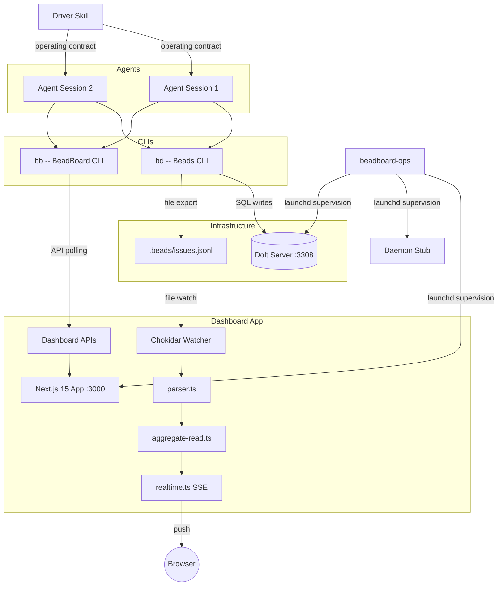
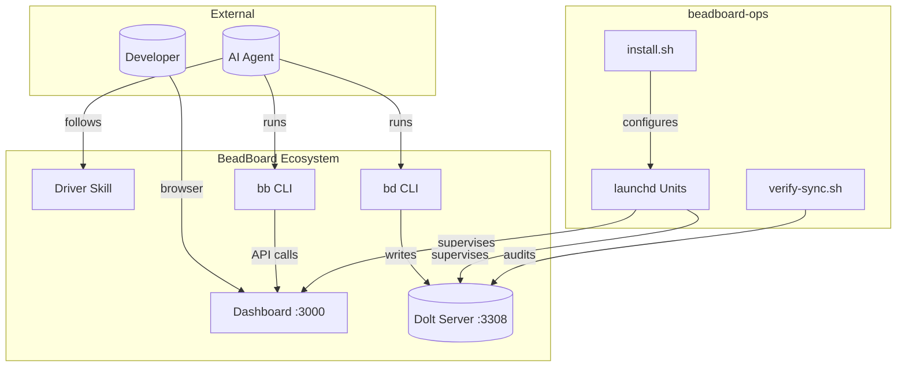

# System Overview

**BeadBoard** is a multi-agent coordination system that gives AI agents (and humans) a shared task board, mail system, and state machine for collaborating on software projects. **beadboard-ops** (this repo) is the operational glue that ties the ecosystem together -- it defines launchd units for process supervision, provides install/uninstall scripts, and wires the driver skill symlinks. It does not fork or modify BeadBoard itself.

## Component Map





## Components at a Glance

| Component | Role | Detail Page |
|-----------|------|-------------|
| **Dashboard** | Real-time Next.js 15 UI showing beads, agents, and mail | [Dashboard](./components/dashboard.md) |
| **Daemon** | Forward-compatible supervisor stub (currently a no-op) | [Daemon](./components/daemon.md) |
| **Shared Dolt Server** | Central SQL database on port 3308 serving all project data | [Dolt Server](./components/dolt-server.md) |
| **Driver Skill** | Agent-side operating contract enforcing the Iron Law | [Driver Skill](./components/driver-skill.md) |
| **Beads CLI (`bd`)** | Task management -- create, update, list, link beads | [Beads CLI](./components/beads-cli.md) |
| **BeadBoard CLI (`bb`)** | Agent coordination -- register, reserve, mail, state | [Beads CLI](./components/beads-cli.md) |
| **beadboard-ops** | Operational glue -- launchd units, install scripts, skill wiring | _(this repo)_ |

:::tip Component Health Quick Check

```bash
launchctl list | grep -E 'beadboard|beads'
curl -s -o /dev/null -w '%{http_code}' http://localhost:3000
lsof -i :3308
```

If all three pass, the system is healthy.
:::

### Dashboard

Next.js 15 + React 19 app serving the BeadBoard UI at `http://localhost:3000`. Uses `@xyflow/react` for graph visualization and Dagre for layout. Supervised by launchd as `com.beadboard.dashboard` with `KeepAlive=true`. See [Dashboard](./components/dashboard.md).

### Daemon

Forward-compatible stub supervised by launchd as `com.beadboard.daemon`. Currently `bb daemon start` is a no-op -- the wrapper script waits 10 seconds for a process, exits 0 if none found. When upstream ships a real daemon, update the pgrep pattern and flip `KeepAlive` to `true`. See [Daemon](./components/daemon.md).

### Shared Dolt Server

Single Dolt SQL server at `127.0.0.1:3308` hosting 23 project databases. All projects share this server (enforced by `BEADS_DOLT_SHARED_SERVER=1` in `~/.zshenv`). Supervised by launchd as `com.beads.shared-dolt-server`. See [Dolt Server](./components/dolt-server.md).

### Driver Skill

The agent-side operating contract that lives at `~/.claude/skills/beadboard-driver` (symlinked into the BeadBoard repo). Defines the 9-step session lifecycle and the Iron Law: no bead claims, handoffs, or completion without assignee + coordination + evidence. See [Driver Skill](./components/driver-skill.md).

### Beads CLI (`bd`) and BeadBoard CLI (`bb`)

Two CLIs: `bd` manages beads (tasks) and writes to Dolt + jsonl; `bb` manages agent coordination (registration, state, mail, reservations). See [Beads CLI](./components/beads-cli.md).

### beadboard-ops (this repo)

Defines three launchd units (`com.beadboard.dashboard`, `com.beadboard.daemon`, `com.beads.shared-dolt-server`), provides `install.sh` / `uninstall.sh`, and wires the driver skill symlink. It is purely operational -- no application code.

:::info Ops Only, No App Code
beadboard-ops contains zero application code. It is purely operational -- launchd units, installer scripts, and skill wiring. The dashboard and CLIs live in the BeadBoard repo.
:::

---

## Next Steps

- [Data Flow](./data-flow.md) -- how beads move through the system end-to-end
- [Dashboard](./components/dashboard.md) -- deep dive into the Next.js app
- [Dolt Server](./components/dolt-server.md) -- database setup and health checks
