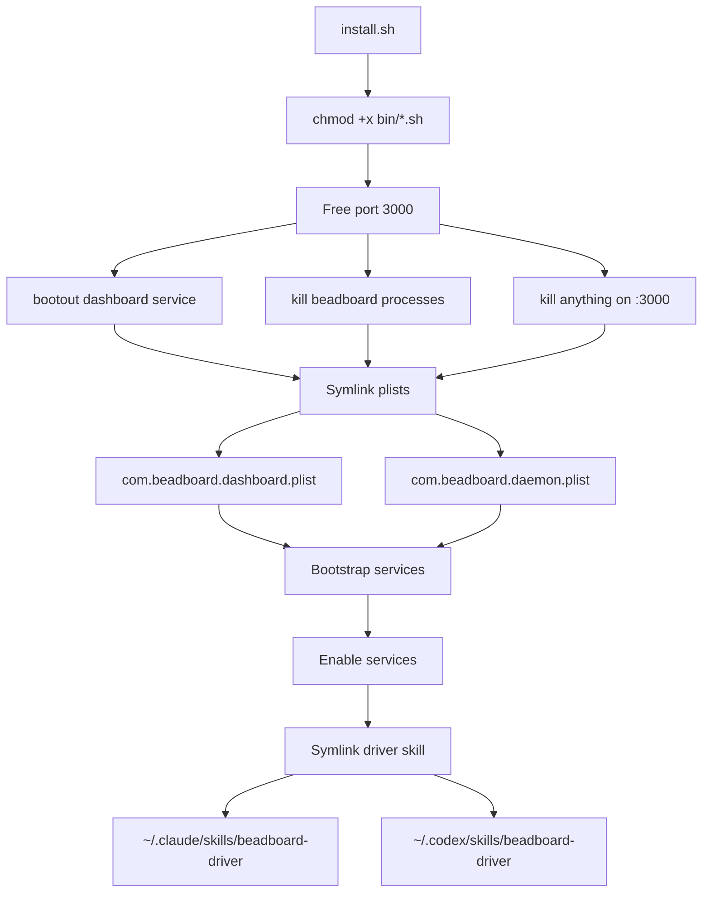

# Installation

## 1. Clone the Repo

```bash
git clone https://github.com/joeblackwaslike/beadboard-ops.git ~/github/joeblackwaslike/beadboard-ops
cd ~/github/joeblackwaslike/beadboard-ops
```

## 2. Run the Installer

```bash
./install.sh
```

This script is idempotent (safe to re-run). It performs the following steps:

1. **Makes wrapper scripts executable** -- `chmod +x bin/*.sh`
2. **Frees port 3000** -- bootouts any existing `com.beadboard.dashboard` service, kills any foreground `beadboard start` or `next` process, and kills anything else on `:3000`
3. **Symlinks and loads launchd plists** -- for each of `com.beadboard.dashboard` and `com.beadboard.daemon`:
   - Symlinks `launchd/<label>.plist` into `~/Library/LaunchAgents/`
   - Bootouts any existing instance
   - Bootstraps and enables the service
4. **Symlinks the beadboard-driver skill** -- links the skill source from the BeadBoard checkout into both `~/.claude/skills/beadboard-driver` and `~/.codex/skills/beadboard-driver`



## 3. Verify Services

```bash
# Both services should appear with PID or exit code 0
launchctl list | grep beadboard
```

Expected output shows two entries:

```text
<PID>   0   com.beadboard.dashboard
-       0   com.beadboard.daemon
```

```bash
$ launchctl list | grep beadboard
87061	0	com.beadboard.dashboard    # ✅ Running (has PID)
-	0	com.beadboard.daemon       # ✅ Exited cleanly (one-shot stub)
```

The dashboard has a PID (it runs continuously via `KeepAlive`). The daemon shows `-` for PID because it is a one-shot that has already exited (this is expected; see [Daemon Design](/docs/architecture/components/daemon)).

## 4. Verify the Dashboard

```bash
curl -s -o /dev/null -w '%{http_code}\n' http://localhost:3000
```

Should print `200`. If it returns a connection error, the dashboard may still be starting -- wait 10 seconds and retry.

:::tip Startup Delay
The dashboard takes 5-10 seconds to compile and start serving. If `curl` returns a connection error immediately after install, wait and retry.
:::

Check logs if it persists:

```bash
tail -20 /tmp/beadboard-dashboard.err
```

Open the dashboard in a browser: [http://localhost:3000](http://localhost:3000)

## 5. Verify the Skill Symlinks

```bash
ls -l ~/.claude/skills/beadboard-driver ~/.codex/skills/beadboard-driver
```

Both should be symlinks pointing to the BeadBoard checkout's `skills/beadboard-driver/` directory.

---

## Uninstalling

```bash
./uninstall.sh
```

This bootouts both launchd services, removes the plist symlinks from `~/Library/LaunchAgents/`, and removes the skill symlinks. It leaves the BeadBoard checkout and the Dolt server (`com.beads.shared-dolt-server`) untouched.

:::info What's Preserved
Uninstalling removes only the launchd services and skill symlinks. Your BeadBoard checkout, Dolt server, and all bead data remain untouched.
:::
