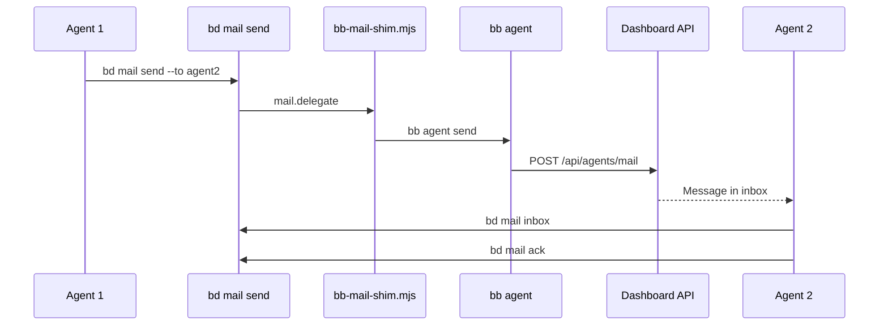
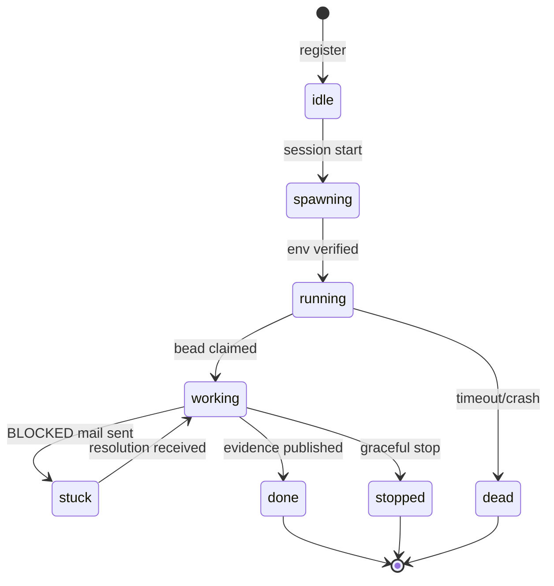

# Agent Integration

How AI agents interact with BeadBoard. This page summarizes the [beadboard-driver skill](../architecture/components/driver-skill.md) lifecycle and the protocols agents use to coordinate.

```mermaid
flowchart LR
    S0[Step 0<br/>Cache Check] --> S1[Step 1<br/>Env Verify]
    S1 --> S2[Step 2<br/>Agent Identity]
    S2 --> S3[Step 3<br/>Note Changes]
    S3 --> S4[Step 4<br/>Read Context]
    S4 --> S5[Step 5<br/>Claim Work]
    S5 --> S6[Step 6<br/>Execute]
    S6 --> S7[Step 7<br/>Verify Gates]
    S7 --> S8[Step 8<br/>Publish & Close]
    S8 --> S9[Step 9<br/>Memory Review]

    style S0 fill:#e8f4fd,stroke:#2196F3
    style S1 fill:#e8f4fd,stroke:#2196F3
    style S2 fill:#fff3e0,stroke:#FF9800
    style S3 fill:#fff3e0,stroke:#FF9800
    style S4 fill:#e8f5e9,stroke:#4CAF50
    style S5 fill:#e8f5e9,stroke:#4CAF50
    style S6 fill:#fce4ec,stroke:#E91E63
    style S7 fill:#f3e5f5,stroke:#9C27B0
    style S8 fill:#f3e5f5,stroke:#9C27B0
    style S9 fill:#e0f2f1,stroke:#009688
```



## Session Lifecycle

Every agent session follows a 10-step lifecycle (Steps 0--9). Skipping steps violates the Iron Law and produces unauditable work.

### Step 0: Cache Check

Read `project.md` in the project root. If it exists and all Environment Status Cache rows show `pass`, skip Step 1 entirely. If missing, run the bootstrap checklist (install `bd`, init `.beads`, install `bb`, configure mail delegate, run preflight, create `project.md`).

:::tip Skip When Cached
If `project.md` exists and all rows show `pass`, the entire environment verification (Step 1) is skipped. Keep your cache fresh to speed up session startup.
:::

### Step 1: Environment Verification

Only runs if `project.md` has a `fail` or `unknown` row. Fix the specific failing check (e.g., reinstall `bd`, reconfigure mail delegate), then update the row to `pass`.

### Step 2: Agent Identity

1. Create a bead for the agent session:
   ```bash
   bd create --title="Agent: bb-<role-name>" --description="<scope>" \
     --type=task --priority=0 --label="gt:agent,role:<role>"
   ```
2. Register with BeadBoard coordination:
   ```bash
   bb agent register --name <role-name> --role <role>
   export BB_AGENT=<role-name>
   ```
3. Verify the mail stack:
   ```bash
   node {baseDir}/scripts/ensure-bb-mail-configured.mjs
   ```
4. Check inbox for pending messages:
   ```bash
   bd mail inbox
   ```
5. Set lifecycle state:
   ```bash
   bd agent state <agent-bead-id> spawning
   bd agent state <agent-bead-id> running
   ```

### Step 3: Note Environment Changes

Update `project.md` only if something changed this session. Otherwise skip.

### Step 4: Read Hard Memory and Task Context

```bash
bd query "label=memory AND label=mem-canonical AND label=<domain>" --sort updated --reverse
bd ready
bd show <target-bead-id>
```

Read task contract, dependencies, success criteria, and blockers before claiming anything.

### Step 5: Claim Work

```bash
bd update <target-bead-id> --status in_progress --assignee <agent-bead-id>
bd slot set <agent-bead-id> hook <target-bead-id>
bd agent state <agent-bead-id> working
```

Never use `--claim`. Always set `--assignee` explicitly.

:::warning Never Use --claim
Always set `--assignee` explicitly. The `--claim` flag has race condition issues in multi-agent environments.
:::

### Step 6: Execute

Work on the task. During execution:

- **Heartbeat** at turn start and before long-running commands:
  ```bash
  bd agent heartbeat <agent-bead-id>
  ```
- **Coordinate via mail** when blocked or handing off:
  ```bash
  bd mail send --to <agent-or-role> --bead <bead-id> \
    --category <HANDOFF|BLOCKED|DECISION|INFO> \
    --subject "<short>" --body "<details>"
  ```
- **Poll inbox** at claim, at close, and periodically during long sessions:
  ```bash
  bd mail inbox
  ```

### Step 7: Verification Gates

Run project checks before claiming completion:

```bash
npm run typecheck
npm run lint
npm run test
```

No completion without fresh gate output from the current session.

:::danger No Shortcuts
Skipping verification gates (typecheck, lint, test) violates the Iron Law. A bead closed without fresh gate output from the current session is considered unauditable.
:::

### Step 8: Publish Evidence and Close

```bash
bd update <target-bead-id> --notes "<commands run + outputs + files changed>"
bd close <target-bead-id> --reason "<what was completed>"
bd slot clear <agent-bead-id> hook
bd agent state <agent-bead-id> done
```

Update `project.md` Environment Status Cache with any checks run this session.

### Step 9: Memory Review

If a reusable lesson emerged, create or supersede a canonical memory bead. Otherwise record: `Memory review: no new reusable memory.`

---

## The Iron Law

```
No bead claims, handoffs, or completion statements without:
1) assignee set
2) coordination checked
3) evidence recorded
```

This is enforced by convention in the driver skill. Every agent following the lifecycle produces an auditable trail: who claimed what, what was checked, what evidence supports completion.

:::info Why the Iron Law Exists
Without explicit state + explicit assignment + explicit evidence, multi-agent coordination devolves into "who did what?" archaeology. The Iron Law makes every action traceable and every completion auditable.
:::

---

## Mail System

Agent-to-agent communication flows through a delegated mail system.

### Architecture

```
bd mail send/inbox/read/ack
  -> mail.delegate (bd config)
    -> bb-mail-shim.mjs
      -> bb agent send/inbox/read/ack
        -> Dashboard API (/api/agents/mail/*)
```

`bd mail` commands are thin wrappers. The `mail.delegate` config points to `bb-mail-shim.mjs` (bundled in the driver skill's `scripts/` directory), which translates calls into `bb agent` commands. The `BB_AGENT` environment variable is injected automatically as the sender identity.

### Mail Categories

| Category | When to Use |
|----------|------------|
| `HANDOFF` | Passing work to another agent |
| `BLOCKED` | Cannot proceed, need input or resolution |
| `DECISION` | Need a decision from human or orchestrator |
| `INFO` | Status update, no action required |

### Commands

```bash
# Check inbox
bd mail inbox

# Send a message
bd mail send --to <agent> --bead <bead-id> --category BLOCKED \
  --subject "Need API key" --body "Cannot proceed without..."

# Read a specific message
bd mail read <message-id>

# Acknowledge (mark handled)
bd mail ack <message-id>
```



---

## Agent States

Agents transition through these states during a session:

| State | Meaning |
|-------|---------|
| `idle` | Registered but not active |
| `spawning` | Session starting, identity created |
| `running` | Environment verified, ready to claim work |
| `working` | Actively executing a claimed task |
| `stuck` | Blocked, sent a BLOCKED mail, waiting for resolution |
| `done` | Task completed, evidence published |
| `stopped` | Gracefully terminated |
| `dead` | Failed or timed out (future: enforced by Witness daemon) |

State transitions are recorded via `bd agent state <agent-bead-id> <state>` and visible in the BeadBoard dashboard in real time.



:::note Heartbeat Enforcement
Heartbeats are currently advisory -- the dashboard displays them but does not enforce timeouts. When the Witness daemon ships, missed heartbeats will automatically transition agents to `dead` state.
:::

---

## Heartbeat Protocol

Heartbeats signal liveness to the dashboard.

```bash
bd agent heartbeat <agent-bead-id>
```

**LLM agents (Claude Code, Codex):** Heartbeat at turn start and immediately before long-running commands (builds, tests). Inter-turn silence is expected and is not a health failure.

**Persistent daemon agents (future):** Every 5 minutes minimum. The Witness enforcement layer (not yet active) will mark agents `dead` on missed heartbeats.

Heartbeats are recorded and visible in the dashboard but not currently enforced programmatically.
