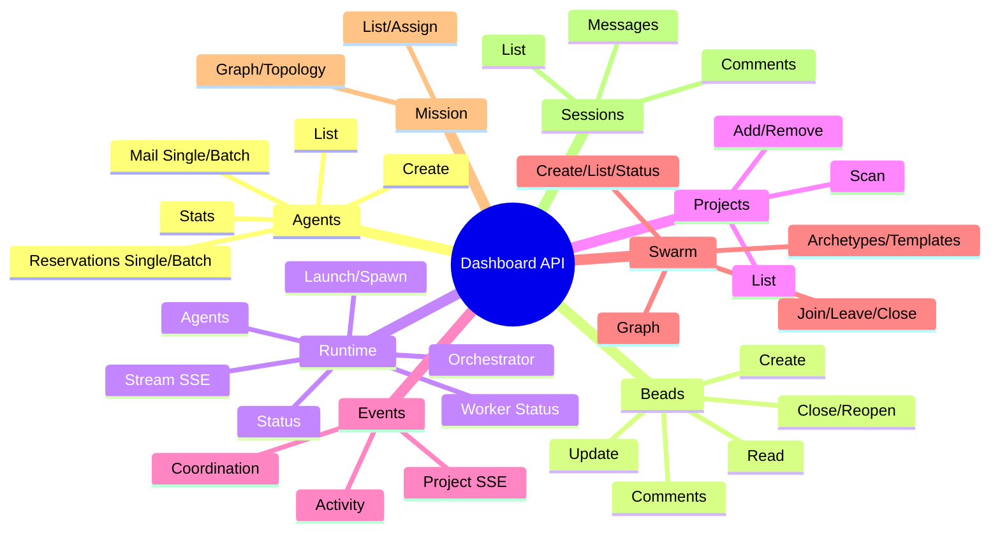

# Dashboard API

HTTP endpoints exposed by the BeadBoard dashboard (Next.js on `localhost:3000`). All endpoints return JSON unless noted otherwise.



:::info Base URL
All endpoints are served from `http://localhost:3000`. Responses are JSON unless noted otherwise (SSE endpoints return `text/event-stream`).
:::

## Agent Endpoints

### List Agents

```
GET /api/agents/list?projectRoot=<path>
```

Returns all registered agents for a project.

| Parameter | Required | Description |
|-----------|----------|-------------|
| `projectRoot` | Yes | Absolute path to the project directory |

```bash
curl -s 'http://localhost:3000/api/agents/list?projectRoot=/path/to/project' | jq
```

Response: `{ "ok": true, "data": [...] }`

### Agent Mail (Single)

```
GET  /api/agents/mail?agent=<name>&limit=<n>
POST /api/agents/mail
```

Single-agent mail operations. GET returns inbox messages; POST handles send, read, and ack via JSON body with an `action` field.

| Parameter | Required | Description |
|-----------|----------|-------------|
| `agent` | Yes | Agent name |
| `limit` | No | Max messages to return (default: 25) |

```bash
curl -s 'http://localhost:3000/api/agents/mail?agent=silver-scribe&limit=10' | jq
```

Error codes: `AGENT_NOT_FOUND` (404), `MESSAGE_NOT_FOUND` (404), `READ_FORBIDDEN` / `ACK_FORBIDDEN` (403), `INTERNAL_ERROR` (500).

:::tip Batch Over Single
Prefer the batch endpoints (`/api/agents/mail/batch`, `/api/agents/reservations/batch`) when checking multiple agents. One request instead of N.
:::

### Agent Mail (Batch)

```
GET /api/agents/mail/batch?agents=<comma-separated>&limit=<n>
```

Batch check mail for multiple agents in one request.

| Parameter | Required | Description |
|-----------|----------|-------------|
| `agents` | Yes | Comma-separated agent names |
| `limit` | No | Max messages per agent (default: 25) |

```bash
curl -s 'http://localhost:3000/api/agents/mail/batch?agents=silver-scribe,iron-forge' | jq
```

Response:

```json
{
  "ok": true,
  "data": [
    { "agent": "silver-scribe", "messages": [] },
    { "agent": "iron-forge", "messages": [] }
  ]
}
```

### Agent Mail Ack

```
POST /api/agents/mail/ack
```

Acknowledge a message (mark as handled).

### Agent Mail Read

```
POST /api/agents/mail/read
```

Mark a message as read.

### Agent Reservations (Single)

```
GET  /api/agents/reservations?agent=<name>&bead=<id>
POST /api/agents/reservations
```

Query or manage scope reservations. GET accepts `agent` or `bead` to filter. POST handles reserve and release operations via JSON body.

```bash
curl -s 'http://localhost:3000/api/agents/reservations?agent=silver-scribe' | jq
```

Error codes: `AGENT_NOT_FOUND` (404), `RESERVATION_NOT_FOUND` (404), `RELEASE_FORBIDDEN` (403).

### Agent Reservations (Batch)

```
GET /api/agents/reservations/batch?agents=<comma-separated>
```

Batch check reservations for multiple agents.

```bash
curl -s 'http://localhost:3000/api/agents/reservations/batch?agents=silver-scribe,iron-forge' | jq
```

Response:

```json
{
  "ok": true,
  "data": [
    { "agent": "silver-scribe", "scope": "src/lib/", "reservations": [] },
    { "agent": "iron-forge", "scope": null, "reservations": [] }
  ]
}
```

### Agent Stats

```
GET /api/agents/<agentId>/stats
```

Returns statistics for a specific agent.

### Create Agent

```
POST /api/agent/create
```

Create a new agent registration. Used by `bb agent register`.

---

## Bead Endpoints

### Create Bead

```
POST /api/beads/create
```

### Read Bead

```
GET /api/beads/read?id=<bead-id>
```

### Update Bead

```
POST /api/beads/update
```

### Close Bead

```
POST /api/beads/close
```

Body: `{ "id": "<bead-id>", "reason": "<text>" }`.

:::warning Closing is Permanent
Closing a bead marks it as completed. Use `POST /api/beads/reopen` if you need to reopen a previously closed bead.
:::

### Reopen Bead

```
POST /api/beads/reopen
```

### Bead Comments

```
GET    /api/beads/<id>/comments
POST   /api/beads/<id>/comments
DELETE /api/beads/<id>/comments/<commentId>
```

---

## Runtime Endpoints

### Worker Status

```
GET /api/runtime/worker-status?beadId=<id>
```

Get the runtime worker status for a specific bead.

| Parameter | Required | Description |
|-----------|----------|-------------|
| `beadId` | Yes | Bead identifier |

```bash
curl -s 'http://localhost:3000/api/runtime/worker-status?beadId=myproject-0a3' | jq
```

Response:

```json
{
  "ok": true,
  "workerStatus": "working",
  "workerDisplayName": "silver-scribe",
  "workerError": null,
  "agentTypeId": "claude-code"
}
```

`workerStatus` values: `idle` (no worker), `spawning`, `running`, `working`, `stuck`, `done`, `stopped`, `dead`.

### Runtime Status

```
GET /api/runtime/status
```

Returns the overall daemon runtime status object.

```bash
curl -s http://localhost:3000/api/runtime/status | jq
```

### Runtime Stream (SSE)

```
GET /api/runtime/stream?projectRoot=<path>
```

Server-Sent Events stream for real-time runtime events.

| Parameter | Required | Description |
|-----------|----------|-------------|
| `projectRoot` | Yes | Absolute path to the project directory |

```bash
curl -N 'http://localhost:3000/api/runtime/stream?projectRoot=/path/to/project'
```

- Initial frame: `: connected\n\n`
- Event frames: `event: runtime\ndata: <JSON>\n\n`
- Heartbeat frames: `: heartbeat\n\n` every 15 seconds
- Poll interval: 250ms for new events

:::note SSE Connection Details
- Initial frame: `: connected\n\n`
- Heartbeat: every 15 seconds
- Event poll interval: 250ms
- Use `curl -N` (no buffer) for real-time output
:::

### Runtime Agents

```
GET /api/runtime/agents
```

List active runtime agents.

### Runtime Agent History

```
GET /api/runtime/agents/history
```

Historical agent session data.

### Launch / Spawn / Bootstrap

```
POST /api/runtime/launch
POST /api/runtime/spawn
POST /api/runtime/bootstrap
```

Internal endpoints for launching and managing agent workers from the dashboard UI.

### Orchestrator

```
POST /api/runtime/orchestrator
```

### Prompt

```
POST /api/runtime/prompt
```

Send a prompt to an active agent worker.

---

## Project Endpoints

### List Projects

```
GET /api/projects
```

```bash
curl -s http://localhost:3000/api/projects | jq
```

Response: `{ "projects": [{ "path": "/Users/joe/myproject" }] }`

### Add Project

```
POST /api/projects
```

Body: `{ "path": "/absolute/path" }`. Returns `201` if newly added, `200` if already registered.

### Remove Project

```
DELETE /api/projects
```

Body: `{ "path": "/absolute/path" }`.

### Scan for Projects

```
GET /api/scan?mode=<default|full-drive>&depth=<n>
```

Scan the filesystem for directories containing `.beads/`.

| Parameter | Required | Description |
|-----------|----------|-------------|
| `mode` | No | `default` or `full-drive` (default: `default`) |
| `depth` | No | Max directory traversal depth (non-negative integer) |

:::tip Auto-Discovery
The dashboard also auto-discovers projects via its chokidar file watcher. The scan endpoint is for manual triggers when you need immediate discovery.
:::

---

## Event Endpoints

### Project Events (SSE)

```
GET /api/events?projectRoot=<path>
```

SSE stream for project-level events (bead changes, activity). Starts a chokidar watcher on the project's `.beads/` directory. Emits `issues` and `activity` event frames.

- Heartbeat: every 15 seconds
- `last-touched` file poll: every 1 second

### Coordination Events

```
POST /api/coord/events
```

Write a coordination event.

```bash
curl -s -X POST http://localhost:3000/api/coord/events \
  -H 'Content-Type: application/json' \
  -d '{"projectRoot": "/path/to/project", "event": {"type": "sync"}}' | jq
```

Response: `{ "ok": true, "eventId": "<id>" }`

Error classifications: `bad_args` (400), other (500).

### Activity Feed

```
GET /api/activity
```

Recent activity across all projects.

---

## Health Endpoint

### bd Health

```
GET /api/bd/health?projectRoot=<path>
```

Checks that `bd` (beads-cli) is reachable and returns its version. Returns `503` if `bd` is not found on PATH.

```bash
curl -s 'http://localhost:3000/api/bd/health?projectRoot=/path/to/project' | jq
```

Response: `{ "ok": true, "data": { "version": "beads-cli 0.x.x" } }`

---

## Swarm Endpoints

<details>
<summary>Swarm Endpoints (12 endpoints)</summary>

Multi-agent swarm orchestration.

| Endpoint | Method | Description |
|----------|--------|-------------|
| `/api/swarm/create` | POST | Create a new swarm |
| `/api/swarm/list` | GET | List active swarms |
| `/api/swarm/status` | GET | Swarm status |
| `/api/swarm/join` | POST | Add agent to swarm |
| `/api/swarm/leave` | POST | Remove agent from swarm |
| `/api/swarm/close` | POST | Close a swarm |
| `/api/swarm/launch` | POST | Launch a swarm |
| `/api/swarm/prep` | POST | Prepare swarm for launch |
| `/api/swarm/graph` | GET | Swarm dependency graph |
| `/api/swarm/archetypes` | GET | List archetypes |
| `/api/swarm/archetypes/<id>` | GET/PUT/DELETE | Manage archetype |
| `/api/swarm/templates` | GET | List templates |
| `/api/swarm/templates/<id>` | GET/PUT/DELETE | Manage template |
| `/api/swarm/formulas` | GET | List formulas |

</details>

---

## Mission Endpoints

<details>
<summary>Mission Endpoints (4 endpoints)</summary>

| Endpoint | Method | Description |
|----------|--------|-------------|
| `/api/mission/list` | GET | List missions |
| `/api/mission/assign` | POST | Assign agent to mission |
| `/api/mission/graph` | GET | Mission dependency graph |
| `/api/mission/<id>/topology` | GET | Mission topology |

</details>

---

## Session Endpoints

<details>
<summary>Session Endpoints (5 endpoints)</summary>

| Endpoint | Method | Description |
|----------|--------|-------------|
| `/api/sessions` | GET | List sessions |
| `/api/sessions/<beadId>/comment` | POST | Add comment |
| `/api/sessions/<beadId>/conversation` | GET | Get conversation |
| `/api/sessions/<beadId>/messages/<id>/ack` | POST | Ack message |
| `/api/sessions/<beadId>/messages/<id>/read` | POST | Mark read |

</details>
