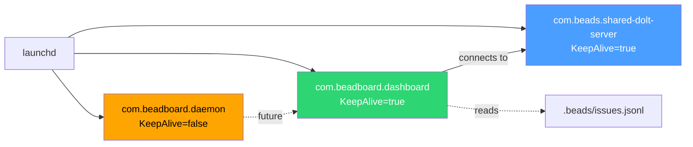
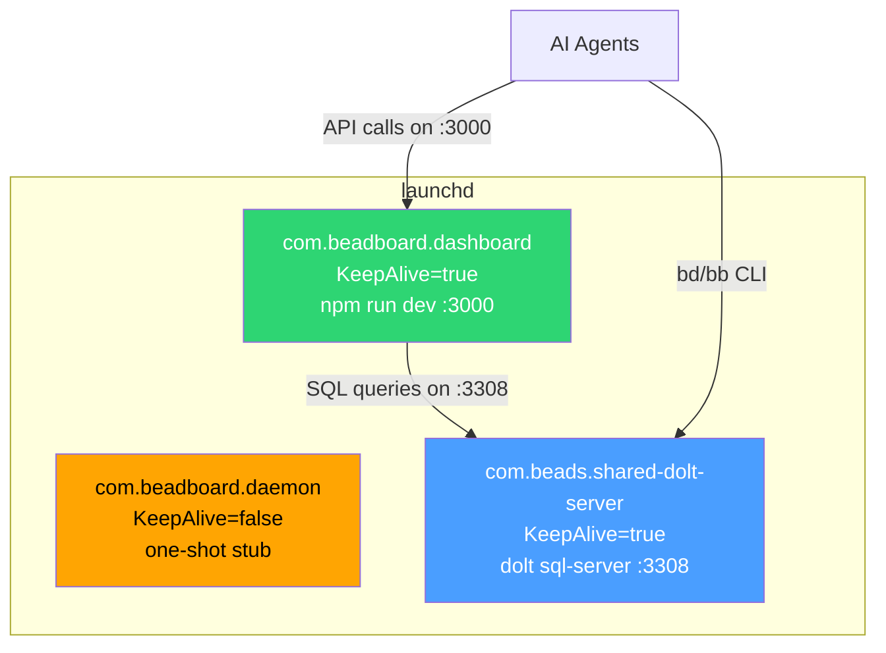

# launchd Services

Configuration reference for the three launchd user agents that form the BeadBoard runtime.

## Service Overview

| Label | Purpose | KeepAlive | RunAtLoad | Log Prefix |
|-------|---------|-----------|-----------|------------|
| `com.beadboard.dashboard` | Next.js dashboard on :3000 | `true` | `true` | `/tmp/beadboard-dashboard` |
| `com.beadboard.daemon` | Execution daemon (stub) | `false` | `true` | `/tmp/beadboard-daemon` |
| `com.beads.shared-dolt-server` | Dolt SQL server on :3308 | `true` | `true` | `~/.beads/shared-server/` |

All three are user-level LaunchAgents installed to `~/Library/LaunchAgents/` as symlinks pointing to the plist files in this repo's `launchd/` directory.



---

## com.beadboard.dashboard

The primary service. Runs the BeadBoard Next.js dashboard in development mode.

### What It Runs

`bin/start-dashboard.sh` -- a zsh wrapper that:

1. Sets `HOME`, `PATH`, and `NVM_DIR`
2. Activates Node 22 via `nvm use 22` (falls back to `--lts`)
3. `cd`s into the BeadBoard checkout at `~/github/joeblackwaslike/jordanhindo/beadboard`
4. Runs `exec npm run dev` (foreground -- launchd supervises directly)

### Plist Configuration

```xml
<key>Label</key>
<string>com.beadboard.dashboard</string>

<key>ProgramArguments</key>
<array>
  <string>/Users/joe/github/joeblackwaslike/beadboard-ops/bin/start-dashboard.sh</string>
</array>

<key>EnvironmentVariables</key>
<dict>
  <key>HOME</key>
  <string>/Users/joe</string>
  <key>PATH</key>
  <string>/opt/homebrew/bin:/usr/local/bin:/usr/bin:/bin</string>
</dict>

<key>RunAtLoad</key>  <true/>
<key>KeepAlive</key>   <true/>

<key>StandardOutPath</key>   <string>/tmp/beadboard-dashboard.log</string>
<key>StandardErrorPath</key> <string>/tmp/beadboard-dashboard.err</string>
```

### Design Decisions

**KeepAlive = true.** The dashboard is a long-running Next.js dev server that should always be available. If it crashes, launchd restarts it automatically.

**`npm run dev` instead of `beadboard start`.** The `beadboard start` CLI runs `npm run dev` in `runtimeRoot` (`~/.beadboard/runtime/<ver>`) when that directory exists. But the daemon bootstrap only partially populates that directory (a `pi/` subdir, no `dev` script), causing `beadboard start` to fail with `Missing script: "dev"`. Running `npm run dev` directly from the repo checkout is the known-good path.

**No `--dolt` flag.** Dolt is supervised by its own service (`com.beads.shared-dolt-server`). Passing `--dolt` to the dashboard would cause two services to fight over the Dolt port and pidfile. If Dolt is briefly down at boot, `KeepAlive` retries the dashboard until Dolt is available.

:::warning Don't Pass --dolt
Never add `--dolt` to the dashboard wrapper. Two services fighting over port 3308 and the Dolt pidfile will cause both to crash repeatedly.
:::

**nvm instead of Homebrew Node.** Homebrew's Node (v26 as of writing) is too new for Next.js 15. The wrapper resolves Node 22 via nvm at runtime rather than hardcoding a version-pinned nvm path (which breaks on nvm upgrades).

### Logs

| File | Content |
|------|---------|
| `/tmp/beadboard-dashboard.log` | Startup messages, Next.js compilation output, request logs |
| `/tmp/beadboard-dashboard.err` | Compilation errors, runtime exceptions, unhandled rejections |

---

## com.beadboard.daemon

The execution daemon service. Currently a forward-compatible stub.

### What It Runs

`bin/start-bb-daemon.sh` -- a zsh wrapper that:

1. Sets `HOME`, `PATH`, `NVM_DIR` and activates Node 22
2. `cd`s into the BeadBoard checkout
3. Runs `beadboard daemon start` (currently a no-op)
4. Searches for a standalone daemon process matching `PGREP_PATTERN='beadboard/runtime/[0-9].*/pi/agent'`
5. If found: monitors the PID (polls every 15s), exits when the process exits
6. If not found: logs `no standalone daemon process (in-process mode)` and exits 0

### Plist Configuration

```xml
<key>Label</key>
<string>com.beadboard.daemon</string>

<key>ProgramArguments</key>
<array>
  <string>/Users/joe/github/joeblackwaslike/beadboard-ops/bin/start-bb-daemon.sh</string>
</array>

<key>EnvironmentVariables</key>
<dict>
  <key>HOME</key>
  <string>/Users/joe</string>
  <key>PATH</key>
  <string>/opt/homebrew/bin:/usr/local/bin:/usr/bin:/bin</string>
</dict>

<key>RunAtLoad</key>  <true/>
<key>KeepAlive</key>   <false/>

<key>StandardOutPath</key>   <string>/tmp/beadboard-daemon.log</string>
<key>StandardErrorPath</key> <string>/tmp/beadboard-daemon.err</string>
```

### Design Decisions

**KeepAlive = false.** The daemon is an under-construction stub. `bb daemon start` spawns no standalone OS process and does not flip lifecycle status -- the runtime is co-resident with the dashboard (daemon-attachment ADR: "near-term in-process attachment seams"). There is nothing to keep alive.

**Forward-compatible wrapper.** The wrapper already contains the full supervisor logic (PID search with 10 retries, 15-second poll loop). When upstream ships a real daemon process, the only changes needed are:
1. Confirm `PGREP_PATTERN` matches the new process
2. Set `KeepAlive` to `true`
3. Rerun `install.sh`

:::tip Minimal Upgrade Path
When the upstream daemon ships, you only need three changes: (1) verify `PGREP_PATTERN`, (2) flip `KeepAlive` to `true`, (3) rerun `install.sh`. The wrapper logic is already complete.
:::

### Logs

| File | Content |
|------|---------|
| `/tmp/beadboard-daemon.log` | Startup timestamp, mode detection (in-process vs standalone) |
| `/tmp/beadboard-daemon.err` | Errors from `beadboard daemon start` |

---

## com.beads.shared-dolt-server

The shared Dolt SQL server. Managed separately from beadboard-ops (installed by `bd init --shared-server` or the `BEADS_DOLT_SHARED_SERVER=1` env var). Documented here for completeness as the third member of the service trio.

### What It Runs

A Dolt SQL server process listening on port 3308. All projects with `.beads/` directories connect to this single shared instance. Each project gets its own database (name derived from the project directory).

### Key Configuration

| Key | Value | Notes |
|-----|-------|-------|
| Port | 3308 | MySQL-compatible protocol |
| User | `root` | No password by default |
| Data directory | `~/.beads/shared-server/` | Contains all project databases |
| Log file | `~/.beads/shared-server/dolt-server.log` | Persists across reboots |
| Lock file | `~/.beads/shared-server/dolt-server.lock` | Remove if stale (see [Maintenance](../runbooks/maintenance.md#stale-lock-file)) |

### Design Decisions

**One shared server, not per-project.** `BEADS_DOLT_SHARED_SERVER=1` in `~/.zshenv` enforces this. Per-project servers drift and break intermittently (stale ports, orphan servers, database-name mismatches). The `--shared-server` flag to `bd init` is belt-and-suspenders.

**Separate from dashboard.** Dolt has its own lifecycle and failure modes. The dashboard's wrapper deliberately omits `--dolt` so the two services don't fight over port 3308 or the pidfile.

:::info Separate Failure Domains
Each service has its own launchd unit so failures are isolated. Dolt crashing doesn't take down the dashboard, and vice versa. `KeepAlive=true` ensures both long-running services auto-restart.
:::

---

## Service Interaction Diagram



```
                    launchd (gui/$(id -u))
                   /          |           \
  com.beadboard.dashboard     |    com.beads.shared-dolt-server
  (KeepAlive=true)            |    (KeepAlive=true)
  -> npm run dev (:3000)      |    -> dolt sql-server (:3308)
              |               |              |
              +-- connects to Dolt ----------+
                              |
             com.beadboard.daemon
             (KeepAlive=false, one-shot)
             -> beadboard daemon start (no-op today)
```

The dashboard connects to Dolt on `:3308` for bead state queries. Agents connect to the dashboard on `:3000` for coordination APIs. The daemon runs once at login and exits (until upstream ships a real process).

## Common launchctl Commands

See the [Operating Runbook](../runbooks/operating.md#manual-service-lifecycle) for the full command reference. Quick summary:

```bash
# Status
launchctl list | grep -E 'beadboard|beads'

# Restart
launchctl kickstart -k gui/$(id -u)/com.beadboard.dashboard

# Stop
launchctl bootout gui/$(id -u)/com.beadboard.dashboard

# Start
launchctl bootstrap gui/$(id -u) ~/Library/LaunchAgents/com.beadboard.dashboard.plist
```
