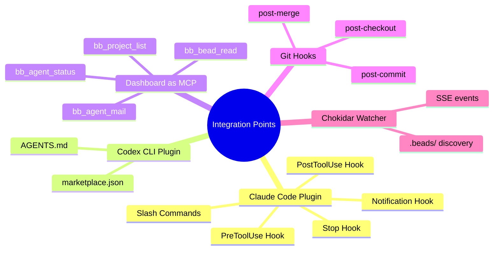

# Plugin Surface Area

Mapping where integrations could add value to the BeadBoard ecosystem. This page documents the seams -- the points where external tools touch BeadBoard -- not proposals to build anything.



## Claude Code Plugin

A Claude Code plugin could automate the agent lifecycle steps that currently require manual `bd`/`bb` commands.

### Available Hook Points

| Hook | Fires When | Potential Use |
|------|-----------|---------------|
| `PreToolUse` | Before any tool call | Heartbeat injection before long-running tools (Bash builds, test runs) |
| `PostToolUse` | After any tool call | State transition detection, auto-update `project.md` cache |
| `Stop` | Session ending | Auto-close bead, publish evidence, set agent state to `done` |
| `Notification` | Incoming notification | Surface BLOCKED/HANDOFF mail as interrupts |

:::info These Are Seams, Not Proposals
This page documents where integrations *could* connect. None of these plugins exist yet -- this is an architectural map for future development.
:::

### Possible Commands

| Command | What It Would Do |
|---------|-----------------|
| `/bb-status` | Show all three services + active agent state in one output |
| `/bb-claim <bead-id>` | Run Steps 2+5 (create agent bead, register, claim work) in one shot |
| `/bb-mail` | Quick inbox check + unread count |
| `/bb-close` | Run Step 8 (publish evidence, close bead, clear slot) |

### Plugin Manifest Location

```
.claude-plugin/plugin.json
```

Hooks would use `command` type executors pointing to scripts in the driver skill's `scripts/` directory or inline shell commands.

---

## Codex CLI Plugin

Same surface as Claude Code, adapted for Codex CLI's plugin format.

### Manifest Location

```
.codex-plugin/marketplace.json
```

### Differences from Claude Code

- No `install` subcommand -- `codex plugin marketplace add` is the only step
- Codex reads `AGENTS.md` as plain Markdown (no `@file` import syntax). The beadboard-driver skill content must be referenced directly in `AGENTS.md`, not imported via `@`.
- Hook format and executor model differ from Claude Code's plugin hooks

---

## Dashboard API as MCP Server

The [Dashboard API](./dashboard-api.md) already exposes a REST interface. Wrapping it as an MCP server would let agents query BeadBoard state directly through their tool system instead of shelling out to `bd`/`bb` CLI commands.

### Candidate Tools

| MCP Tool Name | Maps To | Description |
|--------------|---------|-------------|
| `bb_agent_status` | `GET /api/runtime/worker-status` | Check worker status for a bead |
| `bb_agent_mail` | `GET /api/agents/mail/batch` | Check agent inbox |
| `bb_agent_reservations` | `GET /api/agents/reservations/batch` | Check scope reservations |
| `bb_project_list` | `GET /api/projects` | List tracked projects |
| `bb_bead_read` | `GET /api/beads/read` | Read bead details |
| `bb_health` | `GET /api/bd/health` | Check bd availability |
| `bb_events_subscribe` | `GET /api/events` (SSE) | Subscribe to project events |
| `bb_coord_event` | `POST /api/coord/events` | Write a coordination event |

### Advantages Over CLI

- No shell overhead (no `bd`/`bb` process spawn per call)
- Structured JSON responses directly in the agent's tool output
- SSE subscription for real-time events without `curl -N`
- Single connection point (`:3000`) instead of CLI + Dolt + dashboard

:::tip MCP > CLI for Agents
An MCP server eliminates shell spawning overhead and returns structured JSON directly into the agent's tool output. This is the highest-value integration point.
:::

### Implementation Notes

The MCP server would be a thin wrapper around `fetch('http://localhost:3000/api/...')`. It could live as a standalone MCP server config in `~/.claude/settings.json` or be bundled into a Claude Code plugin.

---

## Git Hooks

`bd hooks install` installs git hooks that keep the Dolt database and the tracked `interactions.jsonl` file in sync across branch operations.

### Installed Hooks

| Hook | What It Does |
|------|-------------|
| `post-commit` | Syncs bead state to Dolt after each commit |
| `post-checkout` | Restores bead state from Dolt when switching branches |
| `post-merge` | Syncs after merge operations |

### Husky Compatibility

In repos using Husky (where `git config core.hooksPath` = `.husky/_`), `bd hooks install` writes to the gitignored `.husky/_` directory, which gets wiped on `pnpm install`. Instead, add the hook manually to the tracked `.husky/<hook>` files:

```bash
command -v bd >/dev/null 2>&1 && bd hooks run <hook> "$@" || true
```

:::warning Husky + bd Hooks
`bd hooks install` writes to `.husky/_` (gitignored), which gets wiped on `pnpm install`. You must manually add beads integration to tracked `.husky/<hook>` files.
:::

### Why Hooks Matter

Without hooks, the Dolt database and tracked `interactions.jsonl` drift across branches. Every checkout becomes a "commit the `.beads/` churn first" chore. The hooks are not installed by `bd init` -- they require a separate `bd hooks install` step.

---

## Chokidar File Watcher

The dashboard uses chokidar to watch the filesystem for `.beads/` directories. This is how projects are auto-discovered without manual registration.

### Watch Behavior

- Watches configured root directories for new/removed `.beads/` folders
- Triggers project list refresh on changes
- Feeds the SSE event stream (`/api/events`) with file-change events
- Polls the `last-touched` file in `.beads/` every 1 second for fine-grained change detection

:::note Auto-Discovery
The chokidar watcher means you don't need to manually register projects. Just run `bd init` in any repo, and the dashboard will discover it automatically.
:::

### Integration Points

- Custom watch paths could extend discovery beyond default directories
- Watch events could trigger webhooks or notifications for external systems
