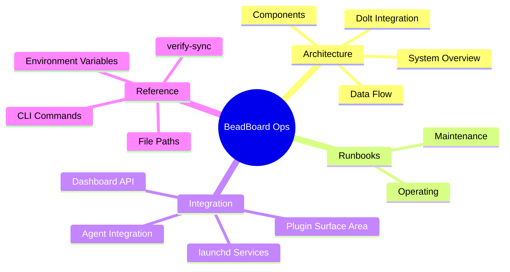

# Overview

**BeadBoard** is a multi-agent coordination system built around the Beads task graph. It provides a real-time Next.js dashboard for visualizing agent state, work assignments, dependencies, and inter-agent mail -- plus a CLI (`bb`) for agent registration, state management, and daemon operations.

**beadboard-ops** is the operational glue that runs BeadBoard as always-on macOS services. It manages two launchd units (dashboard and daemon), wires the beadboard-driver agent skill into Claude Code and Codex CLI, and provides diagnostic tooling for auditing Dolt-to-JSONL sync across all beads-enabled projects.

:::tip Quick Start
New to BeadBoard? Start with [Prerequisites](./prerequisites.md), then [Installation](./installation.md). For architecture context, read [System Overview](./architecture/system-overview.md).
:::

This documentation covers:

- **Architecture** -- how the launchd services, Dolt server, and dashboard fit together; the daemon's forward-compatible design; the driver skill's role in agent sessions.
- **Runbooks** -- step-by-step procedures for day-to-day maintenance, service recovery, and troubleshooting.
- **Integration** -- how beadboard-ops connects to the beadboard-driver skill, the Beads CLI, and per-project beads data.
- **Reference** -- CLI commands, environment variables, file paths, and diagnostic scripts.

## The Iron Law

BeadBoard enforces a coordination discipline: **explicit state + explicit assignment + explicit evidence**. Every agent declares its lifecycle state, every work item is explicitly assigned, and every completion requires recorded evidence. The dashboard and driver skill exist to make this discipline visible and enforceable across multi-agent sessions.

:::info The Three Pillars
The Iron Law requires all three for every bead operation:

1. **Explicit State** -- every agent declares its lifecycle state
2. **Explicit Assignment** -- every work item has a named owner
3. **Explicit Evidence** -- every completion includes recorded proof
:::
