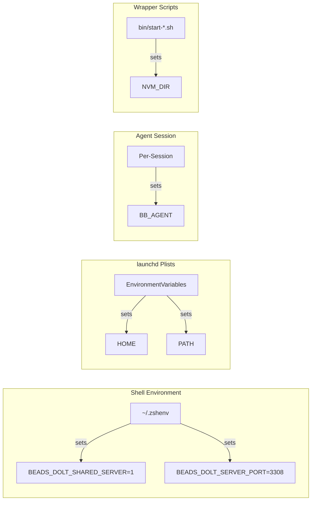

# Environment Variables

| Variable | Value | Where Set | Purpose |
|----------|-------|-----------|---------|
| `BEADS_DOLT_SHARED_SERVER` | `1` | `~/.zshenv` | Force all `bd` commands to use the shared Dolt server instead of per-project instances |
| `BEADS_DOLT_SERVER_PORT` | `3308` | `~/.zshenv` | Pin the shared Dolt server port |
| `BB_AGENT` | `<role-name>` | Per agent session | Agent identity for mail routing and coordination (`bd mail inbox` reads this) |
| `HOME` | `/Users/joe` | launchd plist `EnvironmentVariables` | Ensures `~` resolves correctly in non-interactive shells launched by launchd |
| `PATH` | `/opt/homebrew/bin:...` | launchd plist `EnvironmentVariables` | Ensures `nvm`, `node`, `dolt`, and other Homebrew binaries are findable in launchd context |
| `NVM_DIR` | `$HOME/.nvm` | Shell wrapper scripts | Points nvm to its installation directory; sourced by `bin/start-dashboard.sh` and `bin/start-bb-daemon.sh` |
| `BEADS_DOLT_HOST` | `127.0.0.1` (default) | Optional override | Host for Dolt connections (used by `verify-sync.sh`) |
| `BEADS_DOLT_PORT` | `3308` (default) | Optional override | Port for Dolt connections (used by `verify-sync.sh`, distinct from `BEADS_DOLT_SERVER_PORT`) |
| `GITHUB_ROOT` | `$HOME/github/joeblackwaslike` (default) | Optional override | Root directory for project discovery in `verify-sync.sh` |

:::warning Critical Variables
`BEADS_DOLT_SHARED_SERVER` and `BEADS_DOLT_SERVER_PORT` must be set in `~/.zshenv` (not `~/.zshrc`) because launchd wrapper scripts source `~/.zshenv` but not `~/.zshrc`.
:::

## Notes

- `BEADS_DOLT_SHARED_SERVER` and `BEADS_DOLT_SERVER_PORT` are the most important variables. Without them, `bd init` creates per-project Dolt servers that drift and break intermittently.
- The launchd plist `EnvironmentVariables` block is necessary because launchd runs services in a minimal environment without your shell profile. The wrapper scripts (`bin/start-dashboard.sh`, `bin/start-bb-daemon.sh`) source nvm explicitly for the same reason.
- `BB_AGENT` is set per agent session, not globally. Each agent process sets it to its own role name before using `bd mail`.

:::tip Debugging Environment Issues
If a command works in your terminal but fails in a launchd service, the cause is almost always a missing environment variable. Compare `env` output in your terminal with the plist's `EnvironmentVariables` block.
:::
