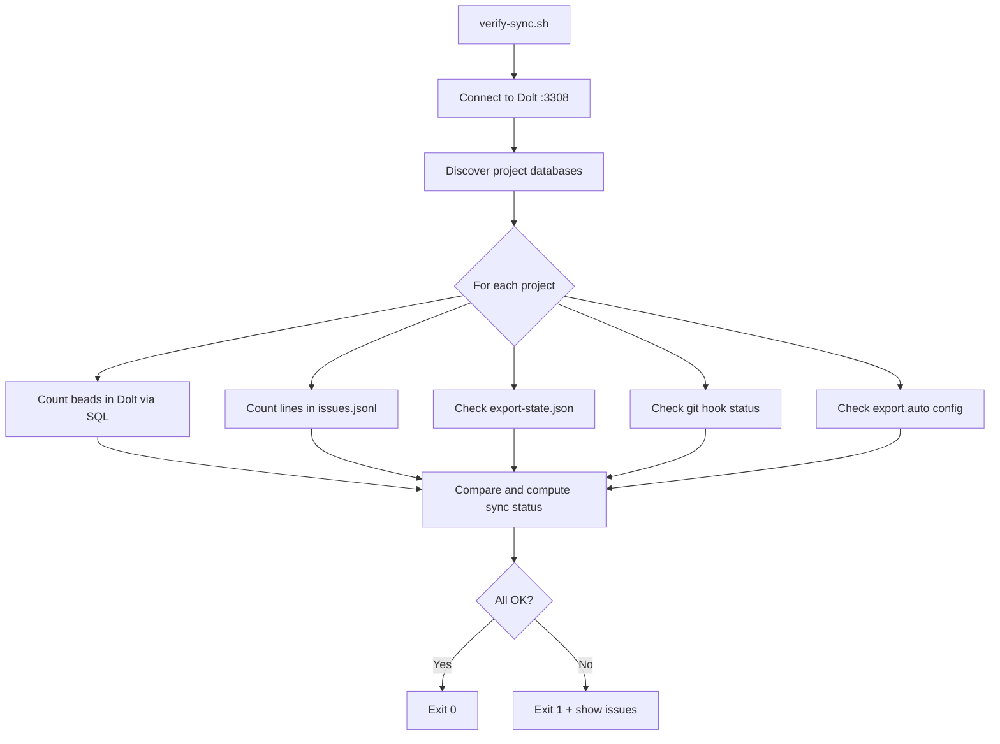

# Diagnostic Script (verify-sync)

`bin/verify-sync.sh` audits the sync state between the shared Dolt server and the per-project `.beads/issues.jsonl` files across all beads-enabled projects.

## What It Does

1. Connects to the shared Dolt server (default `127.0.0.1:3308`)
2. Discovers all project databases in `~/.beads/shared-server/dolt/`
3. For each project:
   - Counts beads in Dolt via SQL query
   - Counts lines in `.beads/issues.jsonl`
   - Checks `export-state.json` for authoritative counts
   - Checks git hook installation status
   - Checks `export.auto` config
4. Outputs a formatted table and summary



## Prerequisites

- **Shared Dolt server** must be running on `:3308`
- **`bd` CLI** must be installed and in PATH
- **`jq`** for parsing JSON output
- **`mysql` client** (comes with `dolt` or `brew install mysql-client`)

:::tip Quick Health Check
Run `verify-sync.sh` as a periodic health check. Exit code 0 means everything is in sync. Add it to your morning routine or a cron job.
:::

## Usage

```bash
./bin/verify-sync.sh
```

### Environment Overrides

| Variable | Default | Purpose |
|----------|---------|---------|
| `BEADS_DOLT_HOST` | `127.0.0.1` | Dolt server host |
| `BEADS_DOLT_PORT` | `3308` | Dolt server port |
| `GITHUB_ROOT` | `$HOME/github/joeblackwaslike` | Root directory for project discovery |

## Output Columns

| Column | Meaning |
|--------|---------|
| **Project** | Project directory name (derived from Dolt database name) |
| **Dolt** | Bead count in Dolt, or `ERR` if query failed |
| **JSONL** | Line count in `issues.jsonl`, or `MISSING` if file absent |
| **Hooks** | Git hook status: `wired`, `husky+bd`, `git-hooks`, `husky`, `path-only`, or `none` |
| **Export** | `auto` if `export.auto=true`, otherwise `manual` |
| **Sync** | Sync verdict (see below) |

## Sync Statuses

| Status | Indicator | Meaning | Remediation |
|--------|-----------|---------|-------------|
| **OK** | ✅ | Dolt and JSONL counts match | No action needed |
| **STALE (+N)** | ⚠️ | JSONL matches last export, but Dolt has N new beads since | Re-export: `bd -C <project> export -o .beads/issues.jsonl` |
| **DRIFT (+N/-N)** | ⚠️ | JSONL and Dolt counts disagree by N | Re-export: `bd -C <project> export -o .beads/issues.jsonl` |
| **MISSING** | ❌ | No `issues.jsonl` file exists | Create it: `bd -C <project> export -o .beads/issues.jsonl` |
| **ERROR** | ❌ | Dolt query failed | Check Dolt server status and database existence |
| **GLOBAL** | 🔵 | The `beads_global` database (not a project) | Informational only, no action needed |
| **NO PROJECT** | 🟡 | Database exists in Dolt but no matching project directory found | Verify project exists or clean up orphaned database |

## Exit Codes

| Code | Meaning |
|------|---------|
| `0` | All projects in sync |
| `1` | At least one project has DRIFT, MISSING, or ERROR status |

## Hook Status Values

| Value | Meaning |
|-------|---------|
| `wired` | `core.hooksPath` points to `.beads/hooks/` and hooks call `bd hooks run` |
| `husky+bd` | Husky repo with `bd hooks run` integrated into tracked hook files |
| `git-hooks` | Standard `.git/hooks/` directory contains `bd hooks run` calls |
| `husky` | Husky repo but `bd hooks run` is NOT integrated (hooks won't sync) |
| `path-only` | `core.hooksPath` set to `.beads/hooks/` but hooks don't call `bd hooks run` |
| `none` | No beads hooks detected |

## Common Workflows

### Fix all STALE/DRIFT projects at once

```bash
# Re-export every project that verify-sync flags
for proj in $(./bin/verify-sync.sh 2>&1 | grep -E 'STALE|DRIFT' | awk '{print $1}'); do
  bd -C "$HOME/github/joeblackwaslike/$proj" export -o .beads/issues.jsonl
done
```

:::warning Fix DRIFT Before Continuing
DRIFT means Dolt and JSONL disagree. The dashboard may be showing stale data. Always re-export before relying on dashboard data.
:::

### Enable auto-export for a project

```bash
bd -C <project-path> config set export.auto true
```

With auto-export enabled, `bd hooks run` triggers export automatically on git operations, keeping the JSONL in sync without manual intervention.

:::info Prevention is Better
With `export.auto=true` and git hooks installed, you should rarely see STALE or DRIFT status. If you do, it usually means hooks were removed or the auto-export throttle hasn't fired yet.
:::
