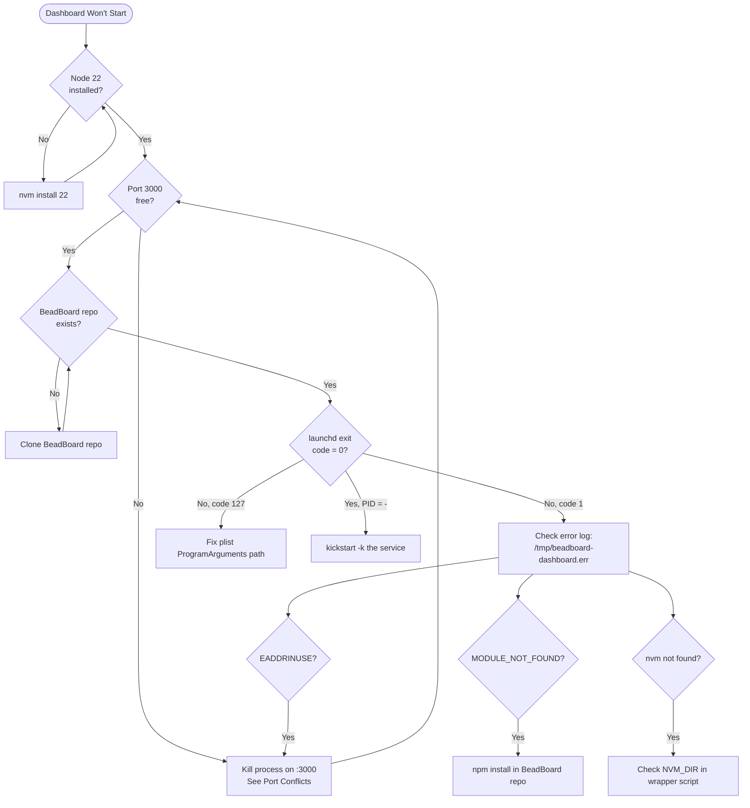

# Maintenance Runbook

Diagnostic procedures and maintenance tasks. Use this when something is broken, needs upgrading, or requires periodic cleanup.



## Dashboard Won't Start

Walk through these checks in order. Stop at the first failure.

1. **Check Node version**
   ```bash
   nvm current
   ```
   Expected: `v22.x`. The dashboard wrapper runs `nvm use 22`. If Node 22 is not installed: `nvm install 22`.

2. **Check port availability**
   ```bash
   lsof -i :3000
   ```
   Should be free or owned by the dashboard's Next.js process. If another process holds it, see [Port Conflicts](./operating.md#port-conflicts).

3. **Check BeadBoard checkout exists**
   ```bash
   ls ~/github/joeblackwaslike/jordanhindo/beadboard/package.json
   ```
   The dashboard wrapper `cd`s into this path. If missing, clone or update the path in `bin/start-dashboard.sh`.

4. **Check launchd status**
   ```bash
   launchctl list | grep dashboard
   ```
   The second column is the last exit status. `0` = clean exit, non-zero = crash. Common codes:
   - `1` -- generic error (check logs)
   - `127` -- script not found (check plist `ProgramArguments` path)
   - `-` in PID column -- not currently running

:::info Exit Code Reference
| Code | Meaning |
|------|---------|
| `0` | Clean exit |
| `1` | Generic error |
| `127` | Script or binary not found |
| `signal` | Killed by signal (e.g., 9 = SIGKILL) |
:::

5. **Check error log**
   ```bash
   cat /tmp/beadboard-dashboard.err
   ```
   Common errors:
   - `EADDRINUSE` -- port 3000 already taken
   - `MODULE_NOT_FOUND` -- run `npm install` in the BeadBoard repo
   - `nvm: command not found` -- nvm not available in launchd environment (check `NVM_DIR` in wrapper)

---

## Dolt Server Issues

### Stale Lock File

Symptom: Dolt won't start, logs show lock acquisition failure.

```bash
rm ~/.beads/shared-server/dolt-server.lock
launchctl kickstart -k gui/$(id -u)/com.beads.shared-dolt-server
```

### Restart Dolt

```bash
launchctl kickstart -k gui/$(id -u)/com.beads.shared-dolt-server
```

:::warning
Removing the lock file while Dolt is actually running can corrupt data. Only remove it if you're sure no Dolt process is active: `pgrep -f "dolt sql-server"` should return nothing.
:::

### Benign Warnings

The following warnings in Dolt logs are expected and harmless:

- `table not found: ignored_schema_migrations` -- projects that have not run schema migrations. Dolt queries this table on connect; it does not exist until the first migration.
- `duplicate column` warnings during `bd init` on already-initialized databases.

:::tip
These warnings appear in Dolt logs frequently and are completely safe to ignore. They do not indicate data corruption or sync failures.
:::

### Verify Dolt Connectivity

```bash
mysql -h 127.0.0.1 -P 3308 -u root -e "SHOW DATABASES;"
```

Each project with a `.beads/` directory appears as a database (name derived from the project directory).

---

## Upgrading BeadBoard

```bash
cd ~/github/joeblackwaslike/jordanhindo/beadboard
git pull
npm install
```

The dashboard auto-restarts via `KeepAlive=true`. If `npm install` changes dependencies significantly, force a restart:

```bash
launchctl kickstart -k gui/$(id -u)/com.beadboard.dashboard
```

---

:::note Future Feature
The daemon is currently a no-op stub. This upgrade procedure is documented for when upstream ships a real daemon process.
:::

## Upgrading the Daemon (Future)

The daemon is currently a stub (`bb daemon start` is a no-op). When upstream ships a real standalone daemon process:

1. Confirm the process matches the pgrep pattern in `bin/start-bb-daemon.sh`:
   ```
   PGREP_PATTERN='beadboard/runtime/[0-9].*/pi/agent'
   ```
   If the real process name differs, update `PGREP_PATTERN`.

2. Edit `launchd/com.beadboard.daemon.plist`: change `KeepAlive` from `<false/>` to `<true/>`.

3. Rerun the installer:
   ```bash
   cd ~/github/joeblackwaslike/beadboard-ops
   ./install.sh
   ```

No other changes needed. The wrapper already contains the full supervisor logic (PID monitoring loop, 15s poll).

---

## Log Rotation

Dashboard and daemon logs go to `/tmp/`, which macOS clears on reboot. For long-running sessions, truncate manually.

```bash
$ ls -lh /tmp/beadboard-*.log /tmp/beadboard-*.err
-rw-r--r--  1 joe  wheel   2.4M Jun 16 07:30 /tmp/beadboard-dashboard.err
-rw-r--r--  1 joe  wheel   156K Jun 16 07:30 /tmp/beadboard-dashboard.log
-rw-r--r--  1 joe  wheel     0B Jun 16 06:45 /tmp/beadboard-daemon.err
-rw-r--r--  1 joe  wheel   312B Jun 16 06:45 /tmp/beadboard-daemon.log
```

Truncate:

```bash
> /tmp/beadboard-dashboard.log
> /tmp/beadboard-dashboard.err
> /tmp/beadboard-daemon.log
> /tmp/beadboard-daemon.err
```

Dolt server logs at `~/.beads/shared-server/dolt-server.log` persist across reboots. Truncate periodically:

```bash
> ~/.beads/shared-server/dolt-server.log
```

---

## Reinstalling

The `uninstall.sh` and `install.sh` scripts are idempotent and safe to re-run.

### What `uninstall.sh` Does

1. Boots out `com.beadboard.dashboard` and `com.beadboard.daemon` from launchd
2. Removes their plist symlinks from `~/Library/LaunchAgents/`
3. Removes beadboard-driver skill symlinks from `~/.claude/skills/` and `~/.codex/skills/`
4. Leaves the BeadBoard checkout and `com.beads.shared-dolt-server` untouched

### What `install.sh` Does

1. Makes wrapper scripts in `bin/` executable
2. Frees port 3000 (boots out dashboard, kills orphaned Next.js and beadboard processes)
3. Symlinks plist files from `launchd/` into `~/Library/LaunchAgents/`
4. Boots out then bootstraps each service (`com.beadboard.dashboard`, `com.beadboard.daemon`)
5. Enables each service in launchd
6. Symlinks `beadboard-driver` skill to `~/.claude/skills/` and `~/.codex/skills/`

### Full Reinstall

```bash
cd ~/github/joeblackwaslike/beadboard-ops
./uninstall.sh
./install.sh
```

Verify:

```bash
launchctl list | grep beadboard
curl -s -o /dev/null -w '%{http_code}\n' http://localhost:3000
ls -l ~/.claude/skills/beadboard-driver ~/.codex/skills/beadboard-driver
```

Expected output:

```bash
$ launchctl list | grep beadboard
87061	0	com.beadboard.dashboard
-	0	com.beadboard.daemon

$ curl -s -o /dev/null -w '%{http_code}\n' http://localhost:3000
200

$ ls -l ~/.claude/skills/beadboard-driver
lrwxr-xr-x  1 joe  staff  ... -> /Users/joe/github/.../beadboard/skills/beadboard-driver/
```

---

## Dolt Database Maintenance

### Garbage Collection

Run per-database to reclaim storage:

```bash
mysql -h 127.0.0.1 -P 3308 -u root -e "USE <database_name>; CALL dolt_gc();"
```

List databases first to find the right name:

```bash
mysql -h 127.0.0.1 -P 3308 -u root -e "SHOW DATABASES;"
```

:::danger Data Loss
Resetting a project's bead database is irreversible. All previous bead history, comments, and links for that project will be permanently lost.
:::

### Reset a Project's Bead Database

If a project's bead database is corrupted beyond repair:

```bash
rm -rf /path/to/project/.beads
cd /path/to/project
bd init --shared-server
bd hooks install
```

This creates a fresh database. All previous bead history for that project is lost.
