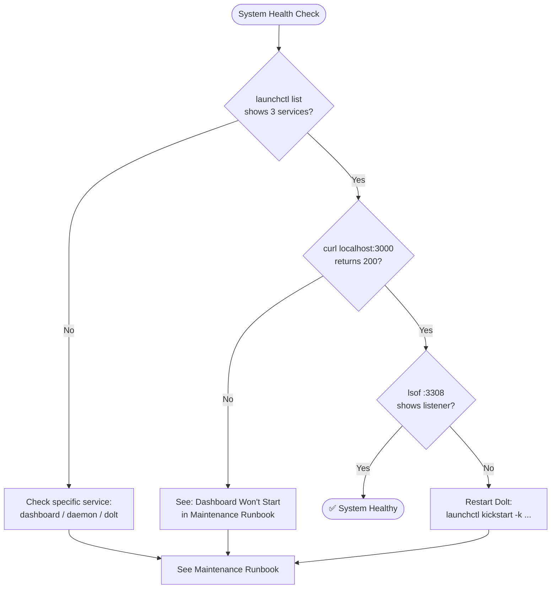
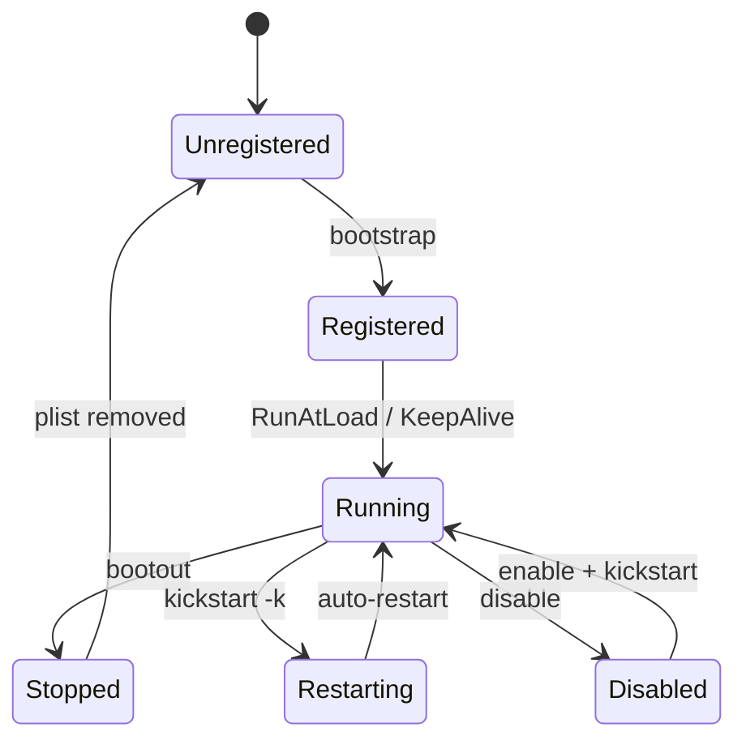

# Operating Runbook

Task-oriented procedures for day-to-day operation of the BeadBoard ecosystem. Each entry includes when to use it and the exact commands.



## Check System Health

Run this whenever something feels off, or as a periodic sanity check. All three services should be present.

```bash
# Check launchd services
launchctl list | grep -E 'beadboard|beads'

# Check dashboard HTTP
curl -s -o /dev/null -w '%{http_code}\n' http://localhost:3000

# Check Dolt server
lsof -i :3308 | head -1
```

Expected output:
- `launchctl list` shows three rows: `com.beadboard.dashboard`, `com.beadboard.daemon`, `com.beads.shared-dolt-server`. The first column is PID (or `-` if not running), the second is last exit status (`0` = clean).
- `curl` returns `200`.
- `lsof` shows a process listening on `:3308`.

```bash
$ launchctl list | grep -E 'beadboard|beads'
87061	0	com.beadboard.dashboard
-	0	com.beadboard.daemon
91234	0	com.beads.shared-dolt-server

$ curl -s -o /dev/null -w '%{http_code}\n' http://localhost:3000
200

$ lsof -i :3308 | head -1
COMMAND   PID USER   FD   TYPE             DEVICE SIZE/OFF NODE NAME
```

---

## Restart the Dashboard

Use when the dashboard is unresponsive or after making config changes to the BeadBoard repo.

```bash
launchctl kickstart -k gui/$(id -u)/com.beadboard.dashboard
```

The `-k` flag kills the existing process first. `KeepAlive=true` ensures launchd restarts it immediately.

:::tip Quick Restart
The `-k` flag to `kickstart` kills the existing process before restarting. You don't need to `bootout` and `bootstrap` separately.
:::

---

## View Live Logs

### Dashboard

```bash
# stdout (startup messages, request logs)
tail -f /tmp/beadboard-dashboard.log

# stderr (Next.js compilation errors, runtime exceptions)
tail -f /tmp/beadboard-dashboard.err
```

### Daemon

```bash
tail -f /tmp/beadboard-daemon.log
tail -f /tmp/beadboard-daemon.err
```

### Dolt Server

```bash
tail -f ~/.beads/shared-server/dolt-server.log
```

---

## Check Tracked Projects

The dashboard discovers projects by watching for `.beads/` directories via chokidar filesystem watcher. When a project with a `.beads/` directory is detected, it appears in the dashboard project list.

To see currently registered projects:

```bash
curl -s http://localhost:3000/api/projects | jq
```

To manually register a project:

```bash
curl -s -X POST http://localhost:3000/api/projects \
  -H 'Content-Type: application/json' \
  -d '{"path": "/absolute/path/to/project"}'
```

To trigger a filesystem scan:

```bash
curl -s 'http://localhost:3000/api/scan?mode=default' | jq
```

---

## Check Agent Status

Query agent state, mail, and reservations via the dashboard API. See [Dashboard API](../integration/dashboard-api.md) for the full endpoint reference.

```bash
# Check agent mail (comma-separated names)
curl -s 'http://localhost:3000/api/agents/mail/batch?agents=silver-scribe' | jq

# Check agent reservations
curl -s 'http://localhost:3000/api/agents/reservations/batch?agents=silver-scribe' | jq

# Check worker status for a specific bead
curl -s 'http://localhost:3000/api/runtime/worker-status?beadId=myproject-0a3' | jq
```

---

## Port Conflicts

### Port 3000 (Dashboard)

:::warning Kill with Caution
Using `kill -9` is a last resort. Try `launchctl bootout` first, which gives the process a chance to clean up.
:::

```bash
# Find what owns the port
lsof -i :3000

# If it's an orphaned Next.js process, kill it
kill -9 <PID>

# Or stop the launchd service entirely, then restart
launchctl bootout gui/$(id -u)/com.beadboard.dashboard
launchctl bootstrap gui/$(id -u) ~/Library/LaunchAgents/com.beadboard.dashboard.plist
```

The install script (`install.sh`) handles this aggressively at install time: it boots out the service, kills any `beadboard.mjs start` or `node_modules/.bin/next` processes, and runs `lsof -ti tcp:3000 | xargs kill` before re-bootstrapping.

### Port 3308 (Dolt)

```bash
lsof -i :3308

# If stale, restart the Dolt service
launchctl kickstart -k gui/$(id -u)/com.beads.shared-dolt-server
```

---

## Manual Service Lifecycle

These are the raw launchctl commands for each lifecycle operation. Replace `com.beadboard.dashboard` with the target service label.

### Bootstrap (register + start)

```bash
launchctl bootstrap gui/$(id -u) ~/Library/LaunchAgents/com.beadboard.dashboard.plist
```

### Bootout (stop + unregister)

```bash
launchctl bootout gui/$(id -u)/com.beadboard.dashboard
```

### Kickstart (restart a running service)

```bash
launchctl kickstart -k gui/$(id -u)/com.beadboard.dashboard
```

### Enable / Disable

```bash
# Enable (allows RunAtLoad and KeepAlive to work)
launchctl enable gui/$(id -u)/com.beadboard.dashboard

# Disable (prevents auto-start, survives reboot)
launchctl disable gui/$(id -u)/com.beadboard.dashboard
```

### Check Status

```bash
# List all beadboard-related services
launchctl list | grep -E 'beadboard|beads'

# Detailed print for a single service
launchctl print gui/$(id -u)/com.beadboard.dashboard
```



:::info Real-Time Monitoring
SSE streams are persistent HTTP connections. Use `curl -N` (no-buffer) to see events as they arrive. Press Ctrl+C to disconnect.
:::

---

## Connect to SSE Event Stream

For real-time monitoring of runtime events (agent spawns, heartbeats, state changes):

```bash
curl -N 'http://localhost:3000/api/runtime/stream?projectRoot=/path/to/project'
```

For project-level issue and activity events:

```bash
curl -N 'http://localhost:3000/api/events?projectRoot=/path/to/project'
```

Both streams send SSE frames (`event: runtime` / `event: issues`). Press Ctrl+C to disconnect.
