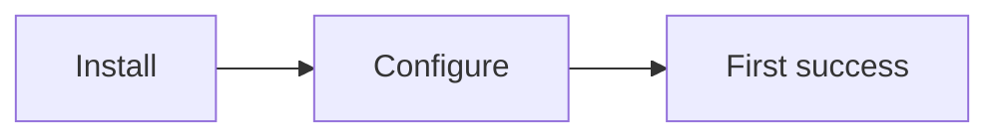

# Markdown and MDX Reference

Use this as the practical authoring guide. Check `references/generated/` for exact current Docusaurus syntax before implementing details.

## Page Front Matter

Common fields:

```md
---
title: Quickstart
description: Install and run the first working example.
sidebar_position: 1
slug: /quickstart
---
```

Use front matter to control title, description, slug, sidebar label/position, draft status, tags, and custom metadata when supported by the current docs plugin.

## Core Markdown

Use standard Markdown for:

- headings
- paragraphs
- lists
- tables
- code fences
- blockquotes
- links
- images

Prefer short sections. If a section grows past 150-200 words, use a table, tabs, diagram, card grid, or example.

## Admonitions

Use admonitions for high-signal guidance:

```md
:::tip
Use this path when you already have a workspace.
:::

:::warning
Do not commit generated secrets.
:::
```

Do not use admonitions as decoration. Each one should change user behavior.

## Code Blocks

Use language tags and titles:

````md
```ts title="src/client.ts"
export const client = createClient();
```
````

Use copy-pastable commands:

````md
```bash
pnpm add @scope/package
```
````

For long examples, explain the outcome before the code and key lines after the code.

## Tabs

Use tabs for variants:

- package managers
- frameworks
- hosting providers
- operating systems
- cloud providers

Do not use tabs to hide required sequential steps.

## MDX Components

Use MDX when plain Markdown cannot make the idea clear enough:

```mdx
import Tabs from '@theme/Tabs';
import TabItem from '@theme/TabItem';
import FeatureGrid from '@site/src/components/FeatureGrid';

<FeatureGrid items={features} />
```

Keep components reusable and content-driven. Avoid hardcoding a one-off layout when a Markdown table or Mermaid diagram works.

## Links

- Use relative links between docs pages.
- Link to exact headings for deep references.
- Prefer stable official URLs for external docs.
- Verify renamed pages and slugs after moving docs.

## Assets

Use static assets for screenshots, diagrams, and social images:

```md

```

Use imported assets in MDX when bundler handling is needed:

```mdx
import demo from './img/demo.png';


```

## Mermaid

Use Mermaid for maintainable diagrams:

````md

````

Use SVG/PNG for branded infographics, screenshots, or diagrams with detailed visual design.

## Tables

Use tables for references:

```md
| Option | Type | Default | Description |
| --- | --- | --- | --- |
| `enabled` | `boolean` | `true` | Turns the feature on. |
```

Do not use wide tables for conceptual explanations on mobile. Split them into cards or subsections.

## Authoring Checklist

- One job per page.
- Clear title and description.
- First code block works.
- Links are relative when internal.
- Images have useful alt text.
- Admonitions are rare and meaningful.
- Tables fit mobile or have a better layout.
- MDX components improve understanding, not decoration.
