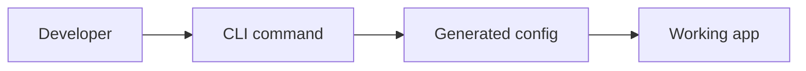

# Visual MDX Patterns

Use MDX to make docs easier to understand, not just prettier.

## Components Worth Creating

- `FeatureGrid`: 3-6 cards for main outcomes.
- `WorkflowSteps`: visual sequence for setup or architecture.
- `BeforeAfter`: pain vs result.
- `TerminalDemo`: command + output proof.
- `InstallTabs`: npm/pnpm/yarn/bun, OS, framework, cloud provider.
- `ConfigTable`: option, type, default, description, example.
- `Callout`: product-specific warning, tip, or decision note.
- `ArchitectureDiagram`: Mermaid or SVG wrapper with caption.

## Page Pattern

```mdx
---
title: Quickstart
description: Install and run the first working example in under five minutes.
---

# Quickstart

Get from install to first success with the smallest useful path.

<InstallTabs />

<TerminalDemo command="pnpm my-tool init" />

## What happened

<WorkflowSteps steps={[...]} />
```

## Visual Density

Avoid long prose blocks. For every section over 150 words, consider:

- a table
- a diagram
- tabs
- a terminal panel
- a card grid
- an annotated screenshot
- a runnable example

## Code Blocks

Use descriptive titles and exact language tags:

````md
```ts title="src/client.ts"
const client = createClient({ apiKey: process.env.API_KEY });
```
````

Use tabs for variants:

```mdx
import Tabs from '@theme/Tabs';
import TabItem from '@theme/TabItem';

<Tabs>
  <TabItem value="pnpm" label="pnpm">

```bash
pnpm add package
```

  </TabItem>
  <TabItem value="npm" label="npm">

```bash
npm install package
```

  </TabItem>
</Tabs>
```

## Diagrams

Use Mermaid for maintainable architecture:

```md

```

Use custom SVG/PNG when brand polish or screenshots matter more than maintainability.
