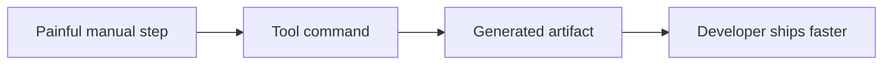

# README Visual System

## GitHub-native First

The README should feel polished inside GitHub, not like an embedded marketing site. Visuals should carry the explanation; avoid walls of text between graphics.

Use:

- logo or wordmark
- terminal demo GIF/video
- terminal panels
- before/after screenshots
- before/after infographics
- architecture infographics
- proof/savings charts
- workflow strips
- annotated product screenshots
- compact architecture diagrams
- Mermaid flows
- benchmark charts
- visual "how it works" strips
- social preview image if the repo needs link previews

Avoid:

- fake nav bars
- pricing cards
- huge hero sections
- CTA buttons drawn as images
- generic gradient blobs
- stock art
- screenshots too small to read

## Asset Placement

Prefer:

```text
assets/readme/
  hero.png
  demo.gif
  demo.mp4
  demo.tape
  architecture.svg
  before-after.png
```

Keep filenames stable and lowercase. Use relative links from `README.md`.

## Sizing

- Hero image: 1200x630 for social reuse, or 1600x900 for detailed screenshots.
- GitHub content width: design for about 800-900px readable width.
- Diagrams: keep text legible at 50 percent scale.
- Terminal demos: keep the hero loop to about 8-20 seconds.
- GIFs: keep short and under repo-friendly size; prefer MP4 linked separately when large.

## Visual Prompt Template

Use one asset per prompt.

```text
Create a GitHub README documentation graphic, not a website.

Project: <name>
Audience: <target developer>
Pain: <pain point>
Outcome: <result>
Visual type: <terminal demo | terminal panel | before/after | architecture diagram | annotated screenshot | benchmark chart>
Style: clean developer documentation, GitHub dark/light compatible, no nav bar, no CTA buttons, no pricing cards, no stock illustration
Content to show: <real commands/output/UI labels>
Output: <PNG/SVG>, transparent or neutral background, readable at README width
```

## Mermaid Guidance

Use Mermaid when the diagram is structural and likely to change:



Use image assets when the visual needs brand polish, screenshots, terminal styling, or charts.

## Dark/Light Mode

Avoid transparent black text. Prefer neutral backgrounds with enough contrast. If using SVG, check it on both GitHub themes or use CSS-safe colors that do not disappear.
