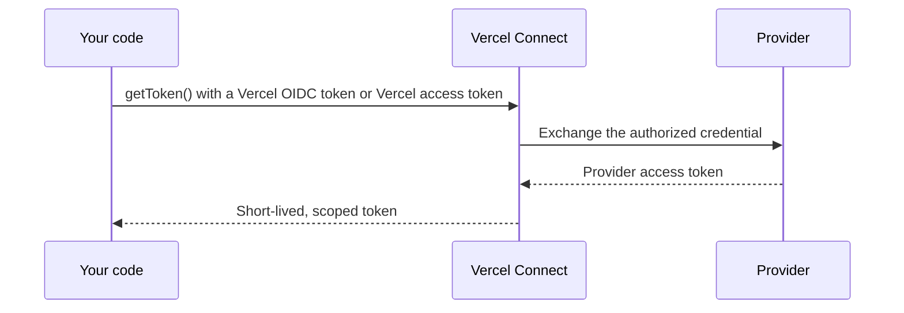

# Vercel Connect

> **🔒 Permissions Required**: Vercel Connect

With [Vercel Connect](/connect), your deployed apps can talk to other services. First, you set up a connection **once** to Slack, GitHub, Microsoft, Snowflake, Salesforce, or any OAuth or API-key service at the team level. Then, any project you allow can use this connection. Your code asks Connect for access at the moment it needs it, so no provider API key ever lives in your environment variables.

<!-- docsgraph:related -->
## Related pages

> **For AI agents:** Follow these links to understand how this page connects to the rest of the Vercel ecosystem. For the full cross-link map (inbound, outbound, prerequisites, and semantic neighbors), see the .graph.md link below.

- [The end of credential sprawl for agents](https://vercel.com/blog/the-end-of-credential-sprawl-for-agents?from=related&source_path=%2Fdocs%2Fconnect&source_site=vercel-docs&relationship=related)
- [Vercel Connect is now generally available](https://vercel.com/changelog/vercel-connect-ga?from=related&source_path=%2Fdocs%2Fconnect&source_site=vercel-docs&relationship=related)
- [Introducing Vercel Connect](https://vercel.com/blog/introducing-vercel-connect?from=related&source_path=%2Fdocs%2Fconnect&source_site=vercel-docs&relationship=related)
- [Vercel Connect: Secure access to external services for your agents](https://vercel.com/changelog/vercel-connect-secure-access-to-external-services-for-your-agents?from=related&source_path=%2Fdocs%2Fconnect&source_site=vercel-docs&relationship=related)
- [Vercel Connect](https://chat-sdk.dev/docs/vercel-connect?from=related&source_path=%2Fdocs%2Fconnect&source_site=vercel-docs&relationship=related) — Authenticate Slack, Discord, GitHub, Linear, Notion, and Telegram adapters with Vercel Connect — short-lived runtime tok
- [Vercel Connect](https://v0.app/docs/vercel-connect?from=related&source_path=%2Fdocs%2Fconnect&source_site=vercel-docs&relationship=related) — Connect your v0 apps and agents to third-party services – no API keys required.
- [Connections](https://eve.dev/docs/connections?from=related&source_path=%2Fdocs%2Fconnect&source_site=vercel-docs&relationship=related) — Expose external MCP and OpenAPI servers to the model, with connection tokens the model never sees.
- [Vercel Connect adds observability support](https://vercel.com/changelog/vercel-connect-adds-observability-support?from=related&source_path=%2Fdocs%2Fconnect&source_site=vercel-docs&relationship=related)
- [Vercel Connect now supports Custom Environments](https://vercel.com/changelog/vercel-connect-now-supports-custom-environments?from=related&source_path=%2Fdocs%2Fconnect&source_site=vercel-docs&relationship=related)
- [Vercel Connect now supports Linq](https://vercel.com/changelog/vercel-connect-now-supports-linq?from=related&source_path=%2Fdocs%2Fconnect&source_site=vercel-docs&relationship=related)
- [Build AI agents with AI Gateway and AI SDK](https://vercel.com/kb/guide/ai-gateway-and-ai-sdk?from=related&source_path=%2Fdocs%2Fconnect&source_site=vercel-docs&relationship=related) — Build AI agents on Vercel with AI Gateway and AI SDK, then make them reliable, capable, and durable with Sandbox, Chat S
- [Build a daily digest bot with Chat SDK and Workflow SDK](https://vercel.com/kb/guide/daily-digest-bot-with-chat-sdk-and-workflow-sdk?from=related&source_path=%2Fdocs%2Fconnect&source_site=vercel-docs&relationship=related) — Build a daily digest bot that posts a daily digest of GitHub stats to Slack. Learn how to use Vercel Connect to set up S

Full cross-link map for this page: [/docs/connect.graph.md](/docs/connect.graph.md?from=related&source_path=%2Fdocs%2Fconnect&source_site=vercel-docs&relationship=graph)
<!-- /docsgraph:related -->

To create your first connector and request a token, follow the [Quickstart](/docs/connect/quickstart). For the conceptual model, see the [Concepts](/docs/connect/concepts) overview, starting with [Connectors](/docs/connect/concepts/connectors), [Tokens](/docs/connect/concepts/tokens), and [Authentication](/docs/connect/concepts/authentication).

## What you can build

- **Call third-party APIs from an agent**: Post to Slack, open GitHub PRs, call Microsoft Graph, query Snowflake, or hit any OAuth- or API-key-protected service without bundling provider secrets into your deployment.
- **Act on behalf of your users**: Ask a user to authorize once, then get a refreshable user token that your agent uses to make calls as that user.
- **Receive provider webhooks**: Verify and forward signed Slack events to project destinations you control.

To do any of these, you [pick a connector](/connect/browse) for the provider you want to reach:

- **[Multiple connector types](/connect/browse)**: Browse the available services, connection methods, and capabilities.
- **[Token subject types](/docs/connect/concepts/tokens#subject-types)**: Issue tokens that act as your service (`app`), a specific user (`user`), or a federated identity (`jwt-bearer`) from a single connector.
- **[Installations and multi-tenancy](/docs/connect/concepts/installations)**: Serve many tenants from one connector, such as Slack workspaces, GitHub organizations, or Microsoft tenants.
- **[Fine-grained scoping](/docs/connect/concepts/tokens#scoping-a-token)**: Narrow each token with provider scopes, resource indicators, and rich authorization requests.
- **[Refresh and revocation](/docs/connect/concepts/tokens#caching-and-refresh)**: Let tokens refresh automatically, and revoke at the provider when supported.
- **[Trigger forwarding](/docs/connect/concepts/triggers)**: Fan out verified webhooks to the project destinations you register on the connector.
- **[Connector branding](/docs/connect/concepts/connectors#branding)**: Set a per-connector icon, background color, and accent color.

Read the [guide to using Vercel Connect in your project](/kb/guide/vercel-connect) for a broader walkthrough of these capabilities.

## How authentication works

When your code calls `getToken()`, Vercel Connect authenticates in two directions: your code authenticates to Vercel Connect with a Vercel OIDC token or a Vercel access token, and Vercel Connect exchanges the authorized credential with the provider.

### From your code to Vercel Connect

The `@vercel/connect` SDK gives you two ways to authenticate:

- **Vercel OIDC token** (recommended): On Vercel, the SDK uses the [OIDC token](/docs/oidc) that Vercel injects into your deployment automatically. Connect verifies the token and checks it against the connector's project links to confirm your project and environment are allowed to request tokens.
- **Access token**: For external CI/CD or non-Vercel environments where `VERCEL_OIDC_TOKEN` isn't available, pass a [Vercel access token](/docs/rest-api#creating-an-access-token) to the SDK through the `vercelToken` option on `getToken`. Dashboard and CLI calls authenticate the same way, using your active Vercel session.

To pull an OIDC token into `.env.local` for local development, follow the [Quickstart](/docs/connect/quickstart).

### From Vercel Connect to the provider

Each connector type has its own provider-side flow:

- **Slack** and **GitHub**: Managed app installs, scoped to one workspace or organization per installation.
- **Microsoft**: A Microsoft Entra app that Vercel registers in your own Microsoft tenant, installed when a tenant administrator grants it admin consent.
- **Custom OAuth**: Managed OAuth against the service's URL, on behalf of the installing user (authorization-code flow) or as your service (client-credentials flow).
- **API key**: A credential the connector owner supplies once at create time.

Each connector defines its provider-side authentication flow. [Browse connectors](/connect/browse) to compare connection methods and setup instructions.

For the full picture, including how token requests are authorized against project links, RBAC for dashboard and CLI calls, the per-connector provider flows, and the error classes thrown on auth failures, see the [Authentication](/docs/connect/concepts/authentication) concepts page.

## Frameworks and adapters

Use the [`@vercel/connect` framework adapters](/docs/connect/frameworks) to add
Connect authentication to AI SDK and MCP clients, eve connections, Chat SDK
adapters, Better Auth, and Auth.js.

## Reference

## Watch what your connectors are doing

Every connector includes an **Observability** tab that logs token requests, authorizations, trigger deliveries, and revocations. Filter events by type, environment, project, or subject, and use stable correlation IDs (`tokenId`, `authorizationId`, `triggerRequestId`) to trace each token across events and match them to your own systems.

To retain events beyond your plan's retention window, forward them to any custom webhook endpoint by adding a [Drain](/docs/drains) (available on Pro and Enterprise plans). See [Observability](/docs/connect/observability) for the full reference.

## Build with the SDK and CLI

- **[SDK Reference](/docs/connect/ts-sdk-reference)**: API reference for `@vercel/connect`, including `getToken`, `getTokenResponse`, the `ConnectTokenParams` and `ConnectTokenResponse` shapes, and the error classes.
- **[CLI Reference](/docs/cli/connect)**: Manage connectors, project links, and triggers from the terminal with `vercel connect`.

## Connector ownership models

You can connect to these providers. Pick the connector that matches the service you want your agent or service to reach:

- **Slack**: Post messages and receive events through a Vercel-developed Slack app, installed per workspace.
- **GitHub**: Open PRs and act on repositories through a Vercel-developed GitHub app, installed per organization or user.
- **Microsoft**: Call Microsoft Graph and Azure APIs through a Microsoft Entra app that Vercel registers in your own Microsoft tenant. You choose its delegated Graph permissions and application permissions at create time, and can change them later. Your code then requests delegated tokens that act as a signed-in user, or app-only tokens that act as the app itself. App-only tokens, and delegated scopes that Microsoft flags as needing an administrator, require a tenant administrator to grant admin consent once.
- **Linear**: Read and write issues through a Vercel-developed Linear app, installed per workspace.
- **Snowflake**: Query data through the Snowflake Partner Connect integration.
- **Salesforce**: Call your Salesforce org through a Vercel-managed OAuth client.
- **Custom OAuth**: Reach any service that supports OAuth or OIDC at a URL you provide. Bring your own client ID and client secret. Supports both the authorization-code flow with PKCE (to act on behalf of a user) and the client-credentials flow (to act as your service). After creating the connector, open it in the dashboard, click **Edit**, and select the grant types you want to enable.
- **API key**: Store a static, long-lived API key for providers that issue one. You supply the key at create time.

### Who registers the OAuth client

The connectors above fall into two operating models, defined in the [Vercel Connect product terms](/docs/connect/legal#1.-definitions). The model determines who registers the OAuth client (or credential) with the Third Party Platform and what setup work falls to you.

- **Vercel Managed Connector**: Vercel registers the OAuth client with the Third Party Platform, and you authorize Vercel's client to access your account or workspace. You do not register an OAuth client or manage client secrets. Slack, GitHub, Linear, Microsoft, Snowflake, and Salesforce use this model. See [Section 3](/docs/connect/legal#3.-vercel-managed-connector) of the Vercel Connect terms.
- **Customer Managed Connector**: You register an OAuth client (or generate an API key) with the Third Party Platform yourself and supply the credentials at create time. Vercel stores them and exchanges tokens on your behalf at runtime. You manage those credentials on the provider side. Custom OAuth and API key use this model.

For providers that support it, [Vercel Assisted Setup](/docs/connect/legal#4.-vercel-assisted-setup) is a one-off helper action that performs some or all of the OAuth-client registration steps on your behalf when you bootstrap a Customer Managed Connector.

Create either kind of connector from the dashboard or with [`vercel connect create`](/docs/cli/connect#vercel-connect-create). For a known service, the CLI prompts you for the [connection method](/docs/connect/concepts/connectors#connection-methods) and any credentials the provider needs, and opens your browser only when the provider requires you to sign in or install an app.

[Browse all connectors](/connect/browse) for the current catalog. Each connector page includes authentication methods, trigger support, and setup instructions.

## Pricing

Vercel Connect is billed per token request. Hobby includes 500 token requests per month at no extra charge. Pro is billed at $3.00 per 1,000 token requests. Enterprise is billed at your negotiated Enterprise rate. Contact your account team for details. See [Pricing](/docs/connect/pricing) for the full table and how to stop being billed.

## Limits

Vercel Connect applies platform limits and per-minute rate limits to SDK methods, CLI commands, and public endpoints. See [Limits](/docs/connect/limits) for the full reference.

## When to use Vercel Connect

Use Vercel Connect when you need delegated runtime credentials, when the same provider serves multiple Vercel projects or environments, or when an agent needs to act on behalf of a user. Use a [Vercel Integration](/docs/integrations) instead when you want a marketplace-managed install for a provider-billed product.

## Start with a template

Deploy an eve template to start building AI agents that use Vercel Connect to
securely access third-party services and APIs:

## Resources

**Quickstart**: Create your first connector and request a runtime token in four steps. [Learn more →](/docs/connect/quickstart)

**Concepts**: Understand connectors, installations, tokens, project links, triggers, and authentication. [Learn more →](/docs/connect/concepts)

**Frameworks and Adapters**: Use Vercel Connect with eve, AI SDK, MCP clients, Chat SDK, Better Auth, and Auth.js. [Learn more →](/docs/connect/frameworks)

**Observability**: Monitor token requests, authorizations, triggers, and revocations for each connector. [Learn more →](/docs/connect/observability)

**Limits**: Platform limits and per-minute rate limits for SDK methods, CLI commands, and public endpoints. [Learn more →](/docs/connect/limits)

**Pricing**: Review token request pricing, included monthly allowances, and how to stop incurring charges. [Learn more →](/docs/connect/pricing)

**SDK Reference**: API reference for @vercel/connect: getToken, getTokenResponse, errors, and caching. [Learn more →](/docs/connect/ts-sdk-reference)

**CLI Reference**: Manage connectors, projects, and tokens with the vercel connect command. [Learn more →](/docs/cli/connect)

**For Service Providers**: OAuth standards your service needs to support so Vercel teams can connect to it. [Learn more →](/docs/connect/providers)

---

[View full sitemap](/docs/sitemap)
