# Native Integration Flows

As a Vercel integration provider, when you [create a native product integration](/docs/integrations/create-integration/marketplace-product), you need to set up the [integration server](https://github.com/vercel/example-marketplace-integration) and use the [Vercel marketplace Rest API](/docs/integrations/create-integration/marketplace-api) to manage the interaction between the integration user and your product.


<!-- docsgraph:related -->
## Related pages

> **For AI agents:** Follow these links to understand how this page connects to the rest of the Vercel ecosystem. For the full cross-link map (inbound, outbound, prerequisites, and semantic neighbors), see the .graph.md link below.

- [Native integration concepts](https://vercel.com/docs/integrations/create-integration/native-integration?from=related&source_path=%2Fdocs%2Fintegrations%2Fcreate-integration%2Fmarketplace-flows&source_site=vercel-docs&relationship=related) — As an integration provider, understanding how your service interacts with Vercel's platform will help you create and opt
- [Add a Native Integration](https://vercel.com/docs/integrations/install-an-integration/product-integration?from=related&source_path=%2Fdocs%2Fintegrations%2Fcreate-integration%2Fmarketplace-flows&source_site=vercel-docs&relationship=related) — Learn how you can add a product to your Vercel project through a native integration.
- [Integration Approval Checklist](https://vercel.com/docs/integrations/create-integration/approval-checklist?from=related&source_path=%2Fdocs%2Fintegrations%2Fcreate-integration%2Fmarketplace-flows&source_site=vercel-docs&relationship=related) — Review this checklist before submitting your native or connectable account integration for approval on the Vercel Market
- [vercel integration](https://vercel.com/docs/cli/integration?from=related&source_path=%2Fdocs%2Fintegrations%2Fcreate-integration%2Fmarketplace-flows&source_site=vercel-docs&relationship=related) — Learn how to manage marketplace native integrations, provision resources, manage individual resources, and discover avai
- [Marketplace](https://vercel.com/docs/flags/marketplace?from=related&source_path=%2Fdocs%2Fintegrations%2Fcreate-integration%2Fmarketplace-flows&source_site=vercel-docs&relationship=related) — Connect your preferred feature flag provider through the Vercel Marketplace for a unified flags experience.

Full cross-link map for this page: [/docs/integrations/create-integration/marketplace-flows.graph.md](/docs/integrations/create-integration/marketplace-flows.graph.md?from=related&source_path=%2Fdocs%2Fintegrations%2Fcreate-integration%2Fmarketplace-flows&source_site=vercel-docs&relationship=graph)
<!-- /docsgraph:related -->

The following diagrams help you understand how information flows in both directions between the integration user, Vercel and your native integration product for each key interaction between the integration user and the Vercel dashboard.

## Create a storage product flow

When a Vercel user, who wants to install a provider native integration, selects **Storage** in the Vercel dashboard sidebar, followed by **Create Database**, they are taken through the following steps to provide the key information required for the provider to be able to create a product for this user.

After reviewing the flow diagram below, explore the sequence for each step:

- [Select storage product](#select-storage-product)
- [Select billing plan](#select-billing-plan)
- [Submit store creation](#submit-store-creation)

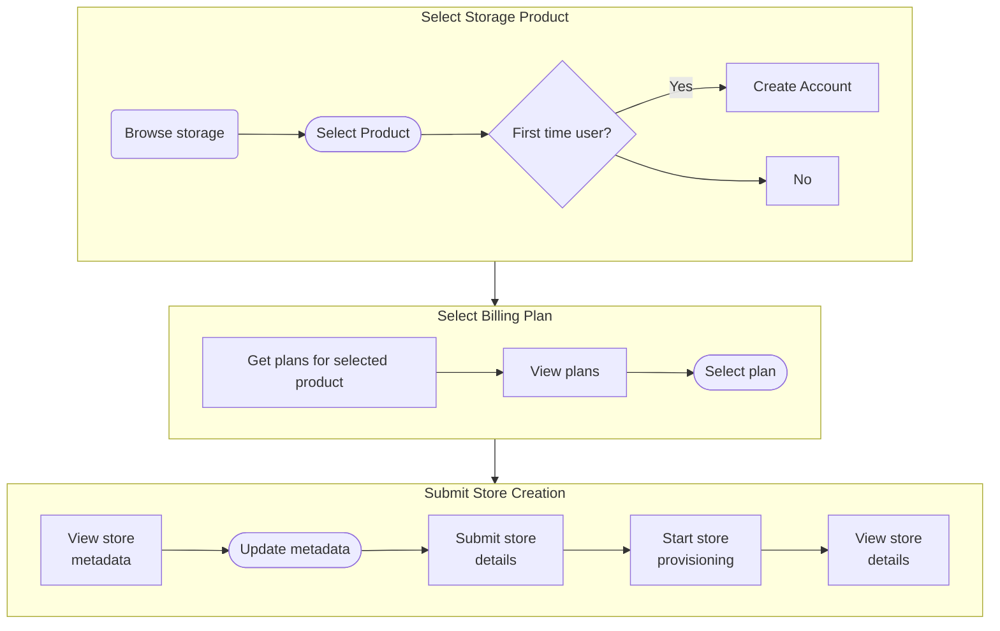

Understanding the details of each step will help you set up the installation section of the [integration server](https://github.com/vercel/example-marketplace-integration).

### Select storage product

When the integration user selects a storage provider product, an account is created for this user on the provider's side if the account does not exist. If that's the case, the user is presented with the Accept Terms modal.

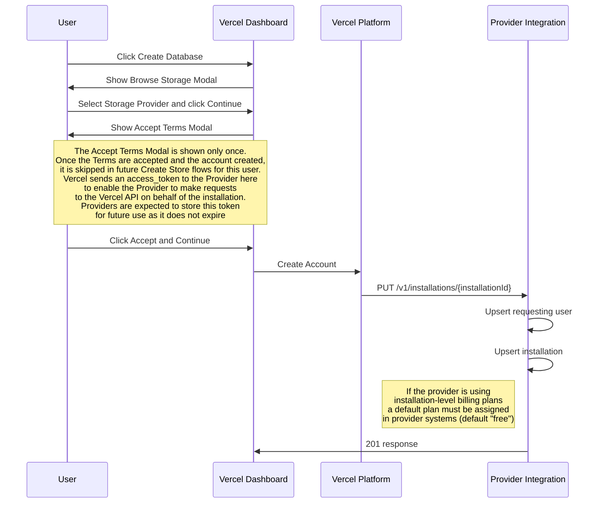

### Select billing plan

Using the installation id for this product and integration user, the Vercel dashboard presents available billing plans for the product. The integration user then selects a plan from the list which is updated on every user input change.

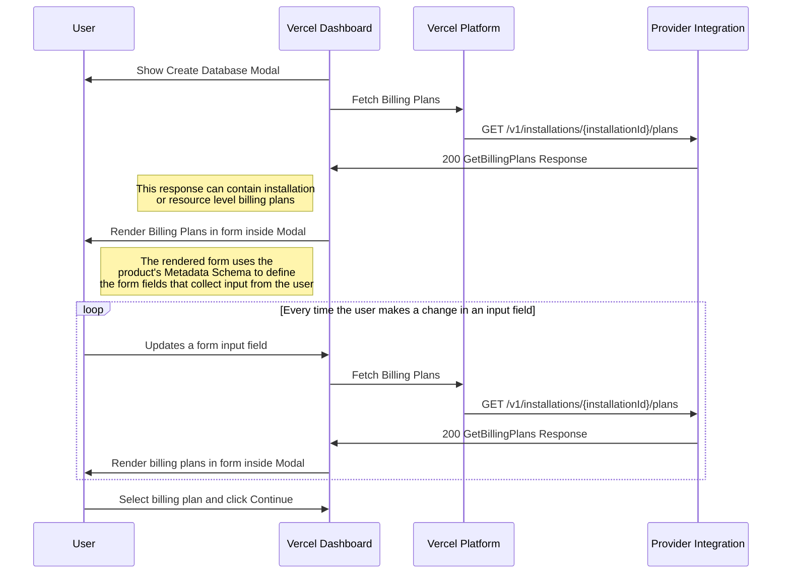

### Submit store creation

After confirming the plan selection, the integration user is presented with information fields that the integration provider specified in the [metadata schema](/docs/integrations/create-integration/marketplace-product#metadata-schema) section of the integration settings. The user updates these fields and submits the form to initiate the creation of the store for this user on the provider platform.

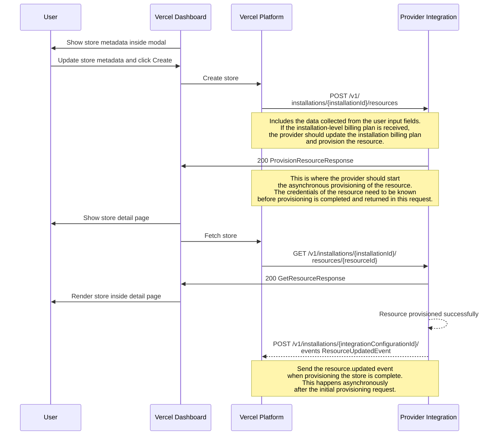

## Connections between Vercel and the provider

### Open in Provider button flow

When an integration user selects the **Manage** button for a product integration from the Vercel dashboard's **Integrations** section in the sidebar, they are taken to the installation settings page for that integration. When they select the **Open in \[provider]** button, they are taken to the provider's dashboard page in a new window. The diagram below describes the flow of information for authentication and information exchange when this happens.

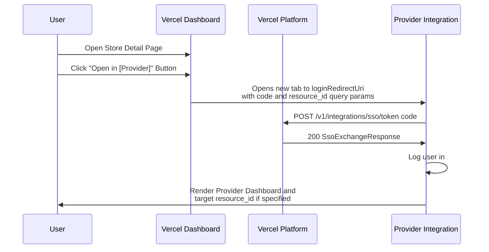

### Provider to Vercel data sync flow

This flow happens when a provider edits information about a resource in the provider's system.

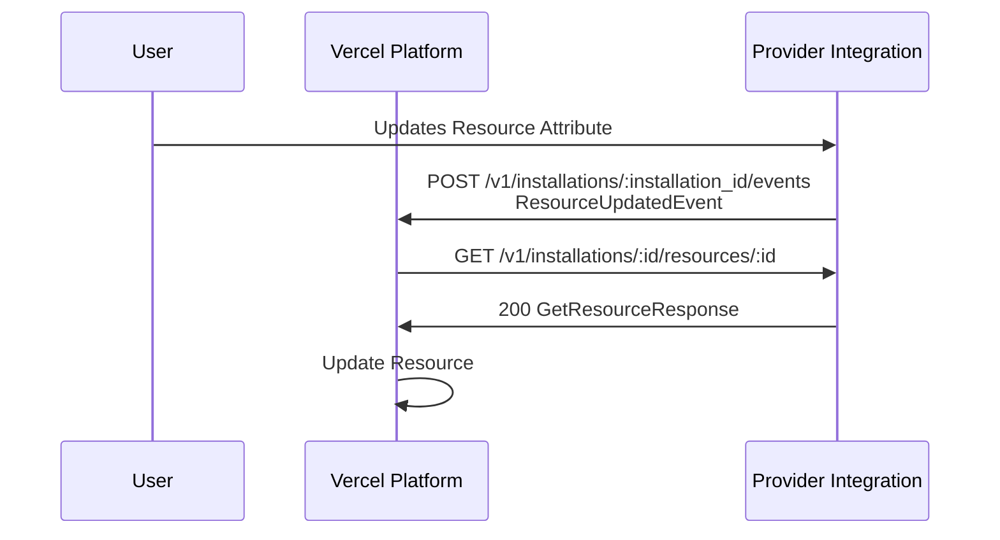

### Vercel to Provider data sync flow

This flow happens when a user who has installed the product integration edits information about it on the Vercel dashboard.

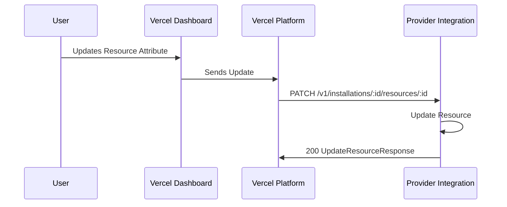

### Rotate credentials in provider flow

This flow happens when a provider rotates the credentials of a resource in the provider system.

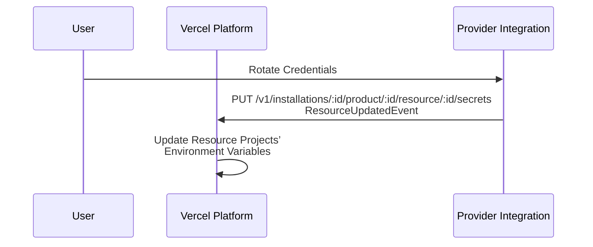

> **💡 Note:** Vercel will update the environment variables of projects connected to the
> resource but will not automatically redeploy the projects. The user must
> redeploy them manually.

## Import existing resources flow

This flow lets an integration user bring a resource that already exists on your platform into their Vercel installation, instead of provisioning a new one. Users start it from the **Import Existing** option on your integration's marketplace page.

To enable it, set the [Import Resource URL](/docs/integrations/create-integration/submit-integration#import-resource-url) in the Integration Console. Connected installations also require a **Redirect URL**; to enable importing for native marketplace installations, contact Vercel.

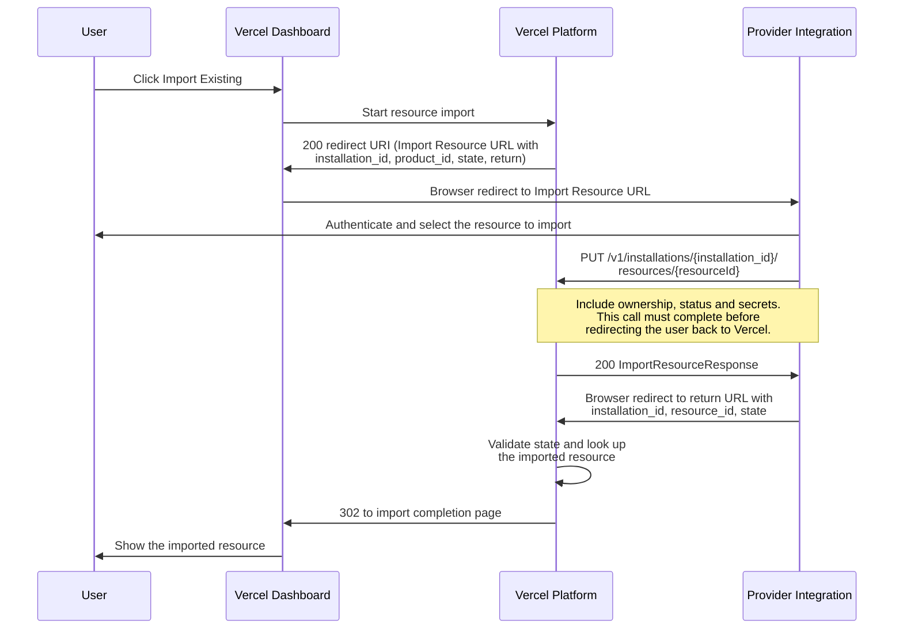

### Start of the import flow

When the user starts an import, Vercel redirects their browser to your Import Resource URL with a GET request that includes the following query parameters:

| Parameter         | Description                                                                                                                          |
| ----------------- | ------------------------------------------------------------------------------------------------------------------------------------ |
| `installation_id` | The ID of the installation the resource will be imported into                                                                          |
| `product_id`      | The slug of the selected product. Only present when the user started the import for a specific product                                |
| `state`           | An opaque, single-use token that secures the flow. Treat it as opaque and return it unchanged. It expires after 12 hours              |
| `return`          | The Vercel URL to redirect the user's browser to once the import is complete. The value is URL-encoded                                 |

For example, your Import Resource URL receives a request like this:

```txt filename="Request to your Import Resource URL"
GET https://example.com/vercel/import?installation_id=icfg_1234567890123&product_id=your_product_slug_here&state=your_state_value_here&return=https%3A%2F%2Fvercel.com%2Fapi%2Fv1%2Fintegrations%2Finstallations%2Fresources%2Fimport%2Fcomplete
```

### Your integration server's responsibilities

1. Authenticate the user on your platform and let them choose the resource to import.
2. Register the resource with Vercel by calling the [Import Resource endpoint](/docs/integrations/create-integration/marketplace-api/reference/vercel/import-resource): `PUT /v1/installations/{installation_id}/resources/{resourceId}`. The `resourceId` path parameter is your external ID for the resource. Set `ownership` to `"linked"` unless the resource is billed through Vercel (see [Linked resources](#linked-resources)), and include the resource's `secrets` so Vercel can sync environment variables to connected projects.
3. Redirect the user's browser to the `return` URL with the following query parameters:

| Parameter         | Description                                                                                  |
| ----------------- | ---------------------------------------------------------------------------------------------|
| `installation_id` | The same installation ID Vercel sent at the start of the flow                                 |
| `resource_id`     | Your external ID for the imported resource, matching the `resourceId` used in the API call    |
| `state`           | The `state` value Vercel sent at the start of the flow, unchanged                             |

For example:

```txt filename="Redirect to the return URL"
https://vercel.com/api/v1/integrations/installations/resources/import/complete?installation_id=icfg_1234567890123&resource_id=your_resource_id_here&state=your_state_value_here
```

> **💡 Note:** Complete the Import Resource API call before redirecting the user back to
> Vercel. Vercel looks up the imported resource while handling the return
> redirect and fails the flow if the resource does not exist yet.

Vercel then validates the `state` parameter (it is single-use and must match the user and installation that started the flow), looks up the imported resource, and redirects the user to the import completion page in the Vercel dashboard.

### Linked resources

Resources imported with `ownership: "linked"` behave differently from resources provisioned through Vercel:

- They are not billed through Vercel.
- Secrets sync and SSO work the same way as for provisioned resources.
- Removing a linked resource from Vercel disconnects it on Vercel's side without calling your Delete Resource endpoint. Contact Vercel if your integration needs the deletion callback for linked resources, for example to revoke credentials your server created for the import.

## Flows for the Experimentation category

### Experimentation flow

This flow applies to the products in the **Experimentation** category, enabling providers to display [feature flags](/docs/flags) in the Vercel dashboard.

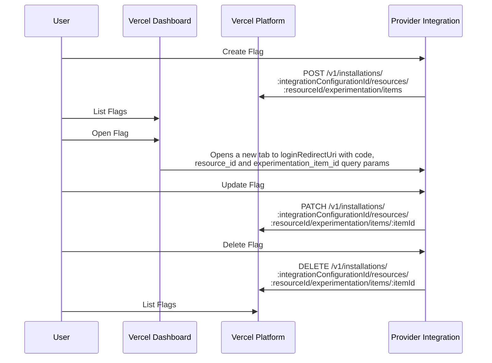

### Experimentation Global Config Syncing

This flow applies to integration products in the **Experimentation** category. It enables providers to push the necessary configuration data for resolving flags and experiments into a [Global Config](/docs/global-config) on the team's account, ensuring near-instant resolution.

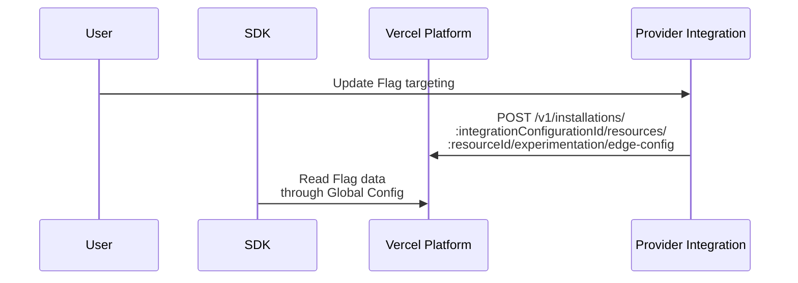

Global Config Syncing is an optional feature that providers can enable for their integration. Users can opt in by enabling it for their installation in the Vercel Dashboard.

Users can enable this setting either during the integration's installation or later through the installation's settings page. Providers must handle this setting in their [Provision Resource](/docs/integrations/create-integration/marketplace-api#provision-resource) and [Update Resource](/docs/integrations/create-integration/marketplace-api#update-resource) endpoints.

The presence of `protocolSettings.experimentation.edgeConfigId` in the payload indicates that the user has enabled the setting and expects their Global Config to be used.

Afterward, providers can use the [Global Config Syncing](/docs/integrations/create-integration/marketplace-api#push-data-into-a-user-provided-edge-config) endpoint to push their data into the user's Global Config.

Once the data is available, users can connect the resource to a Vercel project. Doing so will add an `EXPERIMENTATION_CONFIG` environment variable containing the Global Config connection string along with the provider's secrets.

Users can then use the appropriate [adapter provided by the Flags SDK](https://flags-sdk.dev/providers), which will utilize the Global Config.

## Resources with Claim Deployments

When a Vercel user claims deployment ownership with the [Claim Deployments feature](/docs/deployments/claim-deployments), storage integration resources associated with the project can also be transferred. To facilitate this transfer for your storage integration, use the following flows.

### Ownership transfer requirements

Vercel users can transfer ownership of an integration installation if they meet these requirements:

- They must have DELETE permissions on the source team (Owner role)
- They must also be a valid owner or member of the destination team

This ensures only authorized users can transfer billing responsibility between teams.

### Provision flow

This flow describes how a claims generator (e.g. AI agent) provisions a provider resource and connects it to a Vercel project. Before the flow begins, the claims generator must have installed the provider's integration. The flow results in the claims generator's Vercel team having a provider resource installed and connected to a project under that team.

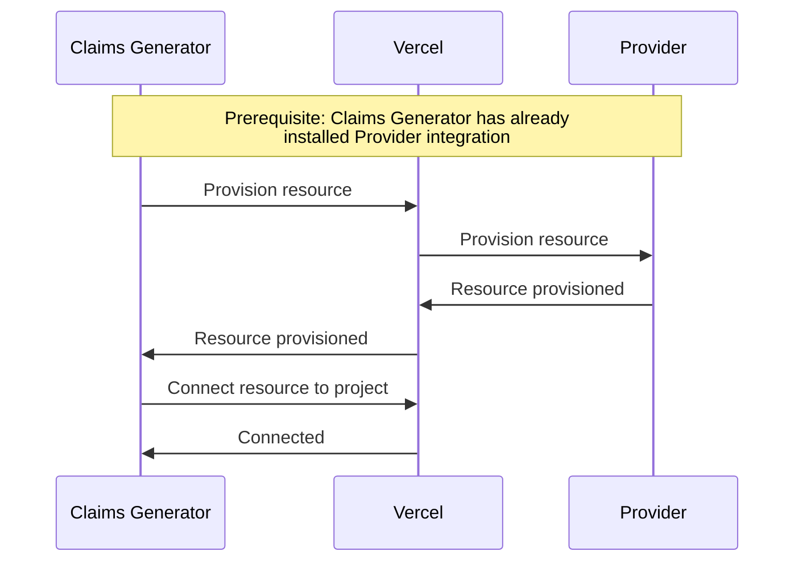

### Transfer request creation flow

This flow describes how a claims generator initiates a request to transfer provider resources, with Vercel as an intermediary. The flow results in the claims generator obtaining a claim code from Vercel and the provider issuing a provider claim ID for the pending resource transfer.

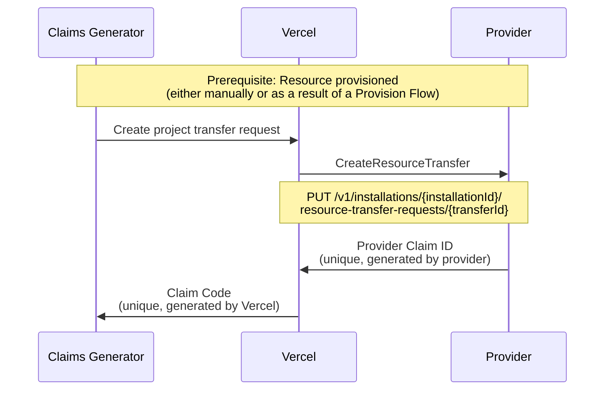

Example for `CreateResourceTransfer` request (Vercel API):

```bash filename="terminal"
curl --request POST \
  --url https://api.vercel.com/projects/<project_id>/transfer-request\?teamId\=<team_id> \
  --header 'Authorization: Bearer <token>' \
  --header 'Content-Type: application/json' \
  --data '{}'
```

`CreateResourceTransfer` response with a claim code:

```json filename="terminal"
{ "code": "c7a9f0b4-4d4a-45bf-b550-2bfa34de1c0d" }
```

### Transfer request accept flow

This flow describes how a Vercel user accepts a resource transfer request when they visit a Vercel URL sent by the claims generator. The URL includes a unique claim code that initiates the transfer to a target team the user owns. Vercel and the provider verify and execute the transfer, resulting in the ownership of the project and associated resources being transferred to the user.

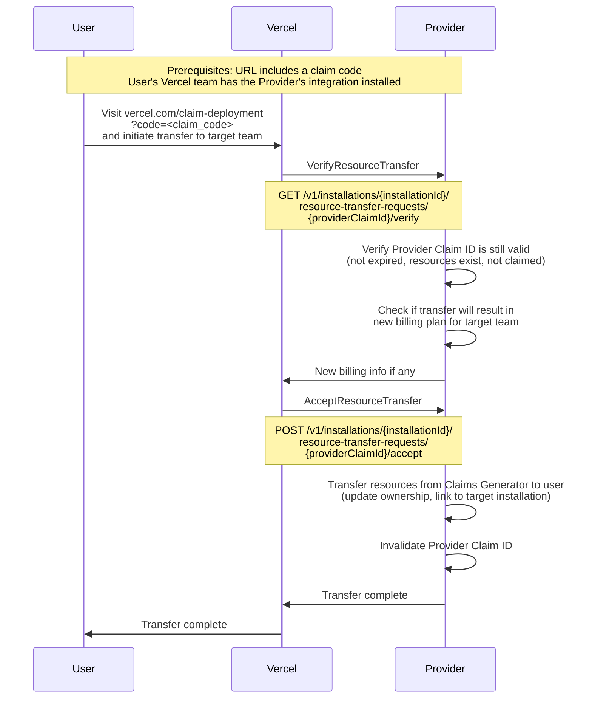

Vercel calls your integration server twice during the accept flow:

**Step 1: Verify the transfer**

**Endpoint:** `GET /v1/installations/{installationId}/resource-transfer-requests/{providerClaimId}/verify`

Verify that the transfer is still valid. Check that:

- The provider claim ID exists and hasn't expired
- The resources still exist
- The transfer hasn't already been completed

**Response:**

```json
{
  "valid": true,
  "billingPlan": {
    "id": "plan_xyz",
    "cost": 10.00
  }
}
```

If the transfer requires a new billing plan for the target team, include it in the response.

**Step 2: Accept the transfer**

**Endpoint:** `POST /v1/installations/{installationId}/resource-transfer-requests/{providerClaimId}/accept`

Complete the transfer by:

- Updating resource ownership from the claims generator to the target user
- Linking resources to the target installation
- Invalidating the provider claim ID

**Request body:**

```json
{
  "targetInstallationId": "icfg_target123",
  "targetTeamId": "team_target456"
}
```

**Response:**

```json
{
  "success": true
}
```

### Troubleshooting resource transfers

If transfers fail, check these common issues:

- **Invalid provider claim ID**: The claim ID might have expired or already been used. Generate a new transfer request.
- **Missing installation**: The target team must have your integration installed. Prompt the user to install it first.
- **Billing plan conflicts**: If the transfer requires a billing plan change, ensure the target team can accept it.
- **Resource ownership**: Verify that resources belong to the source installation before transferring.


---

[View full sitemap](/docs/sitemap)
