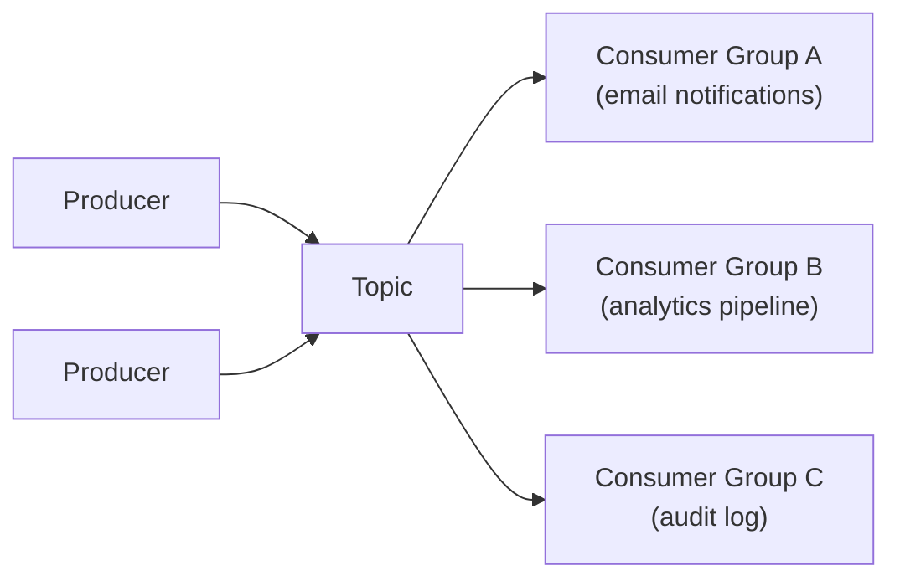

# Vercel Queues

## Process agent events and background work reliably (Beta)

Send messages for agent events and background work to durable topics, then process them with independent consumers, automatic retries, and at-least-once delivery.


<!-- docsgraph:related -->
## Related pages

> **For AI agents:** Follow these links to understand how this page connects to the rest of the Vercel ecosystem. For the full cross-link map (inbound, outbound, prerequisites, and semantic neighbors), see the .graph.md link below.

- [Vercel Queues now in public beta](https://vercel.com/changelog/vercel-queues-now-in-public-beta?from=related&source_path=%2Fdocs%2Fqueues&source_site=vercel-docs&relationship=related)
- [Vercel Queues now supports 7-day message TTL](https://vercel.com/changelog/queues-now-supports-7-day-ttl?from=related&source_path=%2Fdocs%2Fqueues&source_site=vercel-docs&relationship=related)
- [Run background tasks with Celery on Vercel](https://vercel.com/changelog/run-background-tasks-with-celery-on-vercel?from=related&source_path=%2Fdocs%2Fqueues&source_site=vercel-docs&relationship=related)
- [Vercel Functions can now run up to 30 minutes](https://vercel.com/changelog/vercel-functions-can-now-run-up-to-30-minutes?from=related&source_path=%2Fdocs%2Fqueues&source_site=vercel-docs&relationship=related)
- [How to architect an AI evaluation dashboard on Vercel](https://vercel.com/kb/guide/ai-evaluation-dashboard-architecture-on-vercel?from=related&source_path=%2Fdocs%2Fqueues&source_site=vercel-docs&relationship=related) — Map eval orchestration, traces, and run storage to AI Gateway, Observability, and Marketplace Postgres, and learn when s
- [Astro on Vercel vs Webflow Cloud](https://vercel.com/kb/guide/astro-on-vercel-vs-webflow-cloud?from=related&source_path=%2Fdocs%2Fqueues&source_site=vercel-docs&relationship=related) — Compare running Astro on Vercel Functions with Fluid compute against Webflow Cloud on Cloudflare Workers. Learn how Astr
- [Building an AI chat app with RAG and source citations on Vercel](https://vercel.com/kb/guide/building-ai-chat-app-with-rag-and-citations-on-vercel?from=related&source_path=%2Fdocs%2Fqueues&source_site=vercel-docs&relationship=related) — A production stack for AI chat with retrieval, reranking, source citations, and background ingestion on Vercel using Nex
- [How Docker Compose concepts map to Vercel](https://vercel.com/kb/guide/docker-compose-concepts-on-vercel?from=related&source_path=%2Fdocs%2Fqueues&source_site=vercel-docs&relationship=related) — Translate your Docker Compose file to Vercel: Compose services become Vercel Services, networks become bindings, and vol
- [How to build a durable AI code agent on Vercel](https://vercel.com/kb/guide/how-to-build-a-durable-ai-code-agent-on-vercel?from=related&source_path=%2Fdocs%2Fqueues&source_site=vercel-docs&relationship=related) — Build an AI agent that generates code, writes its own tests, and executes them in an isolated microVM with automatic ret
- [A new programming model for durable execution](https://vercel.com/blog/a-new-programming-model-for-durable-execution?from=related&source_path=%2Fdocs%2Fqueues&source_site=vercel-docs&relationship=related)
- [Agentic Infrastructure](https://vercel.com/blog/agentic-infrastructure?from=related&source_path=%2Fdocs%2Fqueues&source_site=vercel-docs&relationship=related)
- [The best workflow engine is a programming language](https://vercel.com/blog/the-best-workflow-engine-is-a-programming-language?from=related&source_path=%2Fdocs%2Fqueues&source_site=vercel-docs&relationship=related)

Full cross-link map for this page: [/docs/queues.graph.md](/docs/queues.graph.md?from=related&source_path=%2Fdocs%2Fqueues&source_site=vercel-docs&relationship=graph)
<!-- /docsgraph:related -->

#### Send a message

```typescript filename="send-message.ts"
import { send } from '@vercel/queue';

const { messageId } = await send('orders', {
  orderId: 'order_123',
  status: 'ready',
});

console.log(messageId);
```

#### Handle a message

```typescript filename="app/api/queues/fulfill-order/route.ts"
import { handleCallback } from '@vercel/queue';

export const POST = handleCallback(async (order, metadata) => {
  console.log('Fulfilling order', metadata.messageId, order);
});
```

#### Configure a consumer

```json filename="vercel.json"
{
  "functions": {
    "app/api/queues/fulfill-order/route.ts": {
      "experimentalTriggers": [{ "type": "queue/v2beta", "topic": "orders" }]
    }
  }
}
```

> **🔒 Permissions Required**: Vercel Queues

Each Vercel Queues topic is a durable, append-only log that retains messages until they expire. Messages fan out to every consumer group subscribed to the topic, and new consumer groups can join at any time to replay non-expired history.



Vercel Queues is useful when you need to:

- **Defer expensive work**: Offload tasks like sending emails, generating PDFs, or calling external APIs so your response returns fast.
- **Absorb traffic spikes**: Buffer incoming requests and process them at a controlled rate.
- **Retry failed work**: Redeliver messages after a consumer crashes or a deployment rolls out, until the handler succeeds or the message expires.
- **Schedule tasks**: Delay message delivery by up to the retention period.
- **Deduplicate publishes**: Use idempotency keys to drop repeated publishes during the message's retention period.
- **Isolate consumers**: Process the same messages in multiple independent pipelines without interference.
- [**Replay agent activity**](/docs/queues/poll-mode#example-multiplayer-ai-agent-replay): Give each viewer an independent replay of an agent's file edits, terminal commands, and tool calls.

Vercel Queues is the lower-level primitive that powers [Vercel Workflows](/docs/workflows). Workflows provides a higher-level SDK with durable steps, sleep, and hooks that makes building multi-step applications more ergonomic. If you need direct control over message publishing, consumption, and routing, use the [Queues SDK](/docs/queues/sdk) directly. If you're building stateful multi-step workflows, start with [Workflows](/docs/workflows).

## Features

- [**Durable delivery**](/docs/queues/concepts): Persist messages with retries and visibility timeouts for reliable processing.
- [**Fan-out consumers**](/docs/queues/concepts): Send one message stream to multiple independent consumer groups without coordination.
- [**Push and poll modes**](/docs/queues/poll-mode): Process on Vercel with push callbacks or run your own workers.
- [**Automatic scaling**](/docs/queues/concepts): Scale producers and consumers without managing partitions or throughput capacity.
- [**SDK and API**](/docs/queues/sdk): Publish and consume with the SDK or HTTP API.
- [**Observability**](/docs/queues/observability): Monitor queue throughput, message age, and consumer performance.

## Resources

**Quickstart**: Set up your first producer and consumer. [Learn more →](/docs/queues/quickstart)

**Concepts**: Learn delivery, retries, durability, and deployment behavior. [Learn more →](/docs/queues/concepts)

**API reference**: Review Queue HTTP endpoints and request/response details. [Learn more →](/docs/queues/api)

**JS SDK Reference**: Publish, consume, and manage messages with @vercel/queue. [Learn more →](/docs/queues/sdk)

**Python SDK Reference**: Publish, consume, and manage messages with vercel-queue. [Learn more →](/docs/queues/python-sdk)

**Poll mode**: Consume messages on your own schedule from any environment. [Learn more →](/docs/queues/poll-mode)

**Observability**: Monitor queue throughput, message age, and consumer performance. [Learn more →](/docs/queues/observability)

**Pricing and limits**: Understand operation billing and service limits. [Learn more →](/docs/queues/pricing)

**Vercel Workflows**: Build durable multi-step workflows on top of Queues. [Learn more →](/docs/workflows)


---

[View full sitemap](/docs/sitemap)
